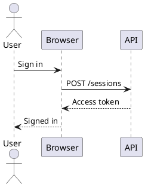
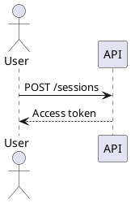
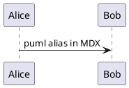
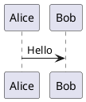

# @matfsw/docusaurus-plantuml-plugin

Render PlantUML diagrams in Docusaurus 3 entirely in the browser — no Java, no PlantUML
server, no Kroki, no CDN.

**→ [Live demo](https://matf.github.io/docusaurus-plantuml-demo)** — every diagram on that site
is rendered by your own browser.

Write a `plantuml` fence in any `.md` or `.mdx` file and the code block is replaced, in the
reader's browser, with an SVG rendered by the official [`@plantuml/core`][plantuml-core]
package:

````markdown

````

**Rendering is 100% same-origin and client-side. Your diagram source never leaves the
browser.** It is not sent to plantuml.com, to a Kroki instance, or to any other service, and
the engine itself is served from your own site's `baseUrl`.

## Status and compatibility

Status: **stable**. `1.0.0` fixes the public surface — plugin options, fence metadata flags,
the `data-*` attributes, and the shape of the rendered markup. Breaking changes to any of them
require a major version.

Explicitly **not** covered by that promise: the generated CSS-module class names, the exact SVG
`@plantuml/core` produces, and the renderer, queue and cache internals — which is why none of
them are exported.

| Requirement     | Supported                                                                              |
| --------------- | -------------------------------------------------------------------------------------- |
| Docusaurus      | `3.5.0` and later `3.x`                                                                |
| Node.js (build) | `>= 20`                                                                                |
| React           | `18.x` or `19.x` (matching your Docusaurus install)                                    |
| Bundler         | webpack (default) and Rspack (`future.v4` / `@docusaurus/faster`)                      |
| PlantUML engine | `@plantuml/core` `1.2026.6`                                                            |
| Browsers        | Modern evergreen browsers; no IE (see [Browser compatibility](#browser-compatibility)) |

The plugin requires a theme that already provides `MDXComponents/Code` — in practice
`@docusaurus/theme-classic`, which you almost certainly have through `preset-classic`.

CI runs the full browser suite against Docusaurus `3.5.2` (the oldest supported release), the
version the example pins, and the newest `3.x` resolved at run time.

### Docusaurus 3.5–3.10.0 need a `webpackbar` override

This is an upstream issue that has nothing to do with this plugin, but it will stop your build
before the plugin is ever reached, so it is worth knowing about.

`@docusaurus/bundler` depended on `webpackbar@^6.0.1` up to and including Docusaurus `3.10.0`,
and `webpackbar` 6 fails `ProgressPlugin`'s option validation against `webpack >= 5.109`. A
fresh install of any Docusaurus `3.5`–`3.10.0` site therefore fails to build with:

```text
ValidationError: Invalid options object.
Progress Plugin has been initialized using an options object that does not match the API schema.
```

If you are on one of those versions and see this, add an override to your **site's**
`package.json` and reinstall:

```json
{
  "overrides": {
    "webpackbar": "^7.0.0"
  }
}
```

Docusaurus `3.10.2` and later depend on `webpackbar@^7` already and need no override. This is
exactly what the compatibility job in CI does to test the `3.5.2` leg.

### A note on the engine's licence

`@plantuml/core` is MIT-licensed **from version `1.2026.6` onwards**. Earlier versions were
published under GPL-3.0-or-later. This plugin depends on `^1.2026.6` for that reason; if you
pin or dedupe `@plantuml/core` to an older version yourself, you inherit the older licence.

## Installation

```bash
npm install @matfsw/docusaurus-plantuml-plugin
```

`@plantuml/core`, `copy-webpack-plugin` and `dompurify` are ordinary dependencies of this
package and are installed for you. `@docusaurus/core`, `react` and `react-dom` are peer
dependencies and come from your site.

## Minimal configuration

```ts
// docusaurus.config.ts
import type {Config} from '@docusaurus/types';

const config: Config = {
  // ...
  plugins: ['@matfsw/docusaurus-plantuml-plugin'],
};

export default config;
```

That is the whole setup. Every option has a default; pass an options object only to change
one:

```ts
// docusaurus.config.ts
import type {Config} from '@docusaurus/types';
import type {PlantUmlPluginOptions} from '@matfsw/docusaurus-plantuml-plugin';

const config: Config = {
  // ...
  plugins: [
    [
      '@matfsw/docusaurus-plantuml-plugin',
      {
        languages: ['plantuml', 'puml'],
        theme: 'auto',
        lazy: true,
        cache: 'memory',
        sanitizeSvg: true,
        showSourceOnError: true,
        renderTimeoutMs: 20_000,
        cacheMaxEntries: 50,
      } satisfies PlantUmlPluginOptions,
    ],
  ],
};

export default config;
```

A plain JavaScript `docusaurus.config.js` works too — the package ships both an ESM and a
CommonJS build of the Node-side entry point.

## Authoring diagrams

### Markdown (`.md`)

````markdown
# Sequence diagram


````

The `title="..."` in the fence metastring becomes both the `<figcaption>` and the accessible
label of the diagram. It is optional.

### MDX (`.mdx`)

The same fence syntax works in MDX, alongside JSX:

````mdx
import Admonition from '@theme/Admonition';

<Admonition type="info" title="MDX">
  Fenced PlantUML works here too.
</Admonition>


````

### Supported fence aliases

By default the plugin claims two fence languages:

- `plantuml`
- `puml`

Matching is **case-insensitive**, so ` ```PlantUML `, ` ```PUML ` and ` ```plantuml ` are all
recognised. Change the set with the `languages` option; entries are normalised to lower case,
must be non-empty, and must not repeat.

Everything else — inline code, ordinary fenced blocks in any other language, and code blocks
authored as JSX children — is delegated to the original Docusaurus `Code` component with its
props untouched. Existing code-block behaviour (highlighting, line numbers, titles,
`showLineNumbers`, copy button) is unchanged.

## Options

| Option              | Type                              | Default                | Description                                                                                                                |
| ------------------- | --------------------------------- | ---------------------- | -------------------------------------------------------------------------------------------------------------------------- |
| `languages`         | `string[]`                        | `['plantuml', 'puml']` | Fence languages treated as PlantUML. Matched case-insensitively; must contain at least one non-empty, non-duplicate entry. |
| `theme`             | `'auto' \| 'light' \| 'dark'`     | `'auto'`               | Diagram colour scheme. `auto` follows the Docusaurus colour mode; `light`/`dark` pin it.                                   |
| `lazy`              | `boolean`                         | `true`                 | Render a diagram only once it scrolls near the viewport (300 px root margin).                                              |
| `cache`             | `'none' \| 'memory' \| 'session'` | `'memory'`             | Where rendered SVG is cached.                                                                                              |
| `sanitizeSvg`       | `boolean`                         | `true`                 | Run rendered SVG through DOMPurify before inserting it. See [Security model](#svg-sanitization-and-security-model).        |
| `showSourceOnError` | `boolean`                         | `true`                 | Include the diagram source in a `<details>` block on the error panel.                                                      |
| `renderTimeoutMs`   | `number`                          | `20000`                | Abort a single render (and the runtime load) after this many milliseconds. Integer, `100`–`600000`.                        |
| `cacheMaxEntries`   | `number`                          | `50`                   | Upper bound on cached SVG entries. Positive integer.                                                                       |
| `zoom`              | `boolean`                         | `true`                 | Let readers zoom and pan diagrams. Adds a control toolbar and a focusable viewport. Override per fence with `zoom=false`.  |
| `id`                | `string`                          | `'default'`            | Docusaurus plugin instance id; only relevant if you register the plugin more than once.                                    |

Options are validated during the Docusaurus configuration phase, before anything is built.
**Unknown keys are rejected** rather than ignored, because a typo in `docusaurus.config.ts`
would otherwise silently disable the option you meant to set:

```text
[docusaurus-plugin-plantuml-client] Unknown option 'sanitiseSvg'. Supported options:
'languages', 'theme', 'lazy', 'cache', 'sanitizeSvg', 'showSourceOnError',
'renderTimeoutMs', 'cacheMaxEntries', 'zoom'.
```

`PlantUmlPluginOptions`, `ResolvedPlantUmlOptions`, `CacheMode`, `DiagramTheme`,
`DEFAULT_OPTIONS`, `resolveOptions` and `PlantUmlOptionsError` are exported from the package
root. The renderer, queue and cache internals are deliberately not exported.

## Light and dark mode

With `theme: 'auto'` (the default), the diagram follows the site's colour mode through
Docusaurus' own `useColorMode()` hook. Toggling the site theme re-renders every visible
diagram with the engine's `{dark}` flag flipped, which changes PlantUML's own fill and stroke
palette rather than merely inverting the picture with CSS.

The colour mode is part of the cache key, so a toggle can never serve the other mode's SVG,
and the engine itself is loaded once per page regardless of how often you toggle.

Set `theme: 'light'` or `theme: 'dark'` to pin the diagram palette independently of the site
theme.

The current mode is exposed on the wrapper as `data-plantuml-theme="light|dark"`.

## Zoom and pan

Large diagrams are unreadable at column width. Rendered diagrams are therefore zoomable and
pannable by default, with a small control toolbar in the top-right corner.

### Interaction

| Input                               | What happens                         |
| ----------------------------------- | ------------------------------------ |
| Plain scroll wheel                  | Scrolls the page. Never intercepted. |
| **Ctrl** + wheel, or trackpad pinch | Zooms about the pointer              |
| Drag                                | Pans, once zoomed in                 |
| One finger on a touchscreen         | Scrolls the page                     |
| Two-finger pinch on a touchscreen   | The browser's own page zoom          |
| Toolbar buttons                     | Zoom out, zoom in, reset, maximize   |

`Cmd` + wheel is deliberately **not** intercepted: on macOS that is the browser's own page
zoom, and taking it over would fight the platform.

### Keyboard

The diagram viewport is focusable. Once focused:

| Key                | Action                      |
| ------------------ | --------------------------- |
| `+` or `=`         | Zoom in                     |
| `-` or `_`         | Zoom out                    |
| `0`                | Reset to 100%               |
| Arrow keys         | Pan                         |
| Shift + arrow keys | Pan by most of the viewport |

Keys with Ctrl, Cmd or Alt held are left to the browser, so shortcuts such as Ctrl + 0 keep
working, and `Tab` always moves on — the diagram is never a keyboard trap.

The toolbar buttons and the keyboard zoom about the **top-left corner** of the viewport, while
the wheel zooms about the **pointer**. That difference is deliberate: a diagram rarely fills its
viewport, and one that fits is left-aligned, so the empty space sits to its right and below.
Zooming about the centre would scale that empty space and push the diagram off the top and left
edges — most visibly when maximized. Anchoring at the top-left grows the diagram into the empty
space instead and keeps it visible as long as possible.

Scale is limited to 0.25×–8×, and the view resets to 100% whenever the diagram source or the
site colour mode changes.

### Maximizing

The fourth toolbar button expands the diagram to fill the browser viewport, fitted to the
available space, over an opaque background. <kbd>Escape</kbd> or the same button restores it,
along with whatever zoom level you had before.

This is an in-page overlay rather than the Fullscreen API. `requestFullscreen()` takes the
entire browser window fullscreen in Firefox instead of presenting the element, and its
`::backdrop` sits outside the element so the page shows through behind the diagram. An overlay
has neither problem, behaves identically in every browser, and needs no capability detection —
so the control also works on iOS Safari, which has no element fullscreen at all.

### Turning it off

Globally:

```ts
['@matfsw/docusaurus-plantuml-plugin', {zoom: false}];
```

Or for a single fence, which overrides the option either way:

````markdown

````

### Why it is on by default, and what that costs

A reader who needs to zoom is rarely the author who would have enabled it, so leaving it off
would mean most readers never discover it. The costs are real and worth knowing:

- Each zoomable diagram adds roughly **four keyboard tab stops** (the viewport and three or
  four buttons). On a page with six diagrams that is a meaningful amount of tabbing.
- The rendered markup gains a viewport and transform wrapper around the `role="img"` container.
  Site CSS that targets `[data-plantuml-diagram] > div[role="img"]` as a **direct child** needs
  updating — see [Accessibility](#accessibility) for both shapes.
- Each diagram costs one non-passive `wheel` listener and one `ResizeObserver`, and only in the
  `ready` state.

Setting `zoom: false` restores the previous markup exactly.

## Lazy loading

With `lazy: true` (the default), a diagram is not rendered until it scrolls within 300 px of
the viewport, observed with `IntersectionObserver`. Consequently:

- The ~8 MB PlantUML runtime is fetched only on pages that actually contain a diagram, and
  only once such a diagram approaches the viewport.
- Diagrams far down a long page cost nothing until the reader gets there.

If `IntersectionObserver` is unavailable (older browsers, some test environments), the
component renders immediately rather than staying blank forever.

Set `lazy: false` to start rendering every diagram as soon as it mounts.

## Caching

Rendered SVG is cached under a deterministic key:

```text
<coreVersion>|<light|dark>|<san|raw>|<sourceLength>|<FNV-1a hash of source>
```

Everything that can change the output is in the key: the `@plantuml/core` version (so an
engine upgrade invalidates every entry), the colour mode, whether the output was sanitized,
and the source itself. The source length is included alongside the 32-bit hash so that a hash
collision alone cannot serve the wrong diagram.

| Mode        | Behaviour                                                                                                                                      |
| ----------- | ---------------------------------------------------------------------------------------------------------------------------------------------- |
| `'none'`    | Nothing is stored. Every mount re-renders.                                                                                                     |
| `'memory'`  | Default. Process-lifetime `Map`, LRU-evicted down to `cacheMaxEntries` (50). Cleared on full page load.                                        |
| `'session'` | `sessionStorage` under `plantuml-client:` keys, FIFO-trimmed to `cacheMaxEntries`. Survives client-side navigation and reloads within the tab. |

The cache is shared by every diagram on the page, so the same source rendered twice is
rendered once. A cache hit skips the render queue entirely.

`sessionStorage` is treated as best-effort: entries that fail to parse or carry the wrong
entry version are discarded and re-rendered, and if `sessionStorage` throws at all (private
browsing modes, quota exhaustion, embedded browsers) the cache silently degrades to an
in-memory cache for the rest of the session. A storage failure never breaks rendering.

## Accessibility

With `zoom: false`, a diagram renders as:

```html
<figure
  aria-busy="true"
  data-plantuml-diagram="plantuml"
  data-plantuml-status="rendering"
  data-plantuml-theme="light"
>
  <div role="img" aria-label="Authentication sequence"><svg>…</svg></div>
  <figcaption>Authentication sequence</figcaption>
  <noscript><pre>@startuml …</pre></noscript>
</figure>
```

With zoom enabled (the default), the same `role="img"` element is wrapped by a viewport and a
transform layer, and a control group is added beside it:

```html
<figure
  data-plantuml-diagram="plantuml"
  data-plantuml-status="ready"
  data-plantuml-theme="light"
  data-plantuml-interactive="true"
>
  <div class="stage">
    <div class="viewport" tabindex="0" aria-describedby="…" data-plantuml-zoom="1">
      <div class="layer">
        <div role="img" aria-label="Authentication sequence"><svg>…</svg></div>
      </div>
    </div>
    <div role="group" aria-label="Authentication sequence zoom controls">…buttons…</div>
  </div>
  <p class="visuallyHidden" id="…">Zoomable diagram. Use the zoom controls, …</p>
  <figcaption>Authentication sequence</figcaption>
  <noscript><pre>@startuml …</pre></noscript>
</figure>
```

`div[role="img"] > svg` holds in both shapes, so a selector written against it keeps working.

- The fence `title="..."` becomes the `<figcaption>` and the `aria-label`. Without a title,
  the accessible label falls back to **`PlantUML diagram`**.
- Progress is conveyed with `aria-busy` on the `<figure>`, deliberately **not** with an
  `aria-live` region: a page with a dozen diagrams would otherwise announce a dozen state
  changes and make the page unusable with a screen reader.
- Errors are announced once, through `role="alert"` on the error panel.
- Failure is never signalled by colour alone — the panel carries a literal `Error:` label and
  a ⚠ glyph in addition to the danger colouring, so it survives colour-blindness and
  forced-colours mode.
- Readers without JavaScript get the diagram source in a `<noscript>` block.
- The spinner animation is disabled under `prefers-reduced-motion: reduce`, as is the easing of
  discrete zoom steps. Dragging and wheel zooming stay instantaneous either way, because direct
  manipulation is not decoration.
- Zoom controls live **outside** the `role="img"` element. That role makes its whole subtree
  opaque to assistive technology, so a button placed inside would be invisible to screen-reader
  users.
- The control group is `role="group"`, not `role="toolbar"`: the toolbar role obliges arrow-key
  navigation between its buttons, and the arrow keys already pan the diagram.
- Button labels are static and the zoom percentage is `aria-hidden`. A live percentage would
  announce on every wheel tick.
- Keyboard instructions are attached to the viewport with `aria-describedby` rather than being
  announced on focus repeatedly.

### `data-*` contract

These attributes are part of the public surface; write your own end-to-end tests against
them.

| Attribute                   | Values                                                     |
| --------------------------- | ---------------------------------------------------------- |
| `data-plantuml-diagram`     | the fence language that matched, e.g. `plantuml` or `puml` |
| `data-plantuml-status`      | `idle` \| `loading` \| `rendering` \| `ready` \| `error`   |
| `data-plantuml-theme`       | `light` \| `dark`                                          |
| `data-plantuml-interactive` | `true`, on the `<figure>`, only when zoom is enabled       |
| `data-plantuml-zoom`        | current scale on the viewport, e.g. `1`, `2.5`             |

## SVG sanitization and security model

PlantUML output is generated from diagram source, and diagram source can express markup —
labels, `<style>` blocks, hyperlinks. The rendered SVG is therefore treated as untrusted and,
by default, passed through [DOMPurify][dompurify] before it reaches the DOM:

- `USE_PROFILES: {svg: true, svgFilters: true}` — geometry, text, gradients, filters, markers
  and links survive.
- Additionally forbidden: `foreignObject`, `script`, `iframe`, `object`, `embed`, `audio`,
  `video`. `foreignObject` matters most: it is the one SVG element that can host arbitrary
  HTML, which would reintroduce precisely the injection surface the SVG profile exists to
  remove. PlantUML does not need it.
- `formaction`, `xlink:show` and `ping` attributes are dropped; `role` and the `aria-label` /
  `aria-labelledby` / `aria-describedby` attributes are preserved so the diagram stays
  accessible.
- Event-handler attributes (`onload`, `onclick`, …) and `javascript:` URLs are removed by
  DOMPurify itself.

If sanitization removes so much that no `<svg>` root remains, the plugin raises an error
rather than showing a silently blank figure.

### Disabling sanitization

`sanitizeSvg: false` is a supported, documented opt-out — and a genuine risk. With it off,
**whatever HTML or JavaScript a diagram author can express in PlantUML's output is injected
into your page verbatim** and executes with your site's origin, cookies and storage. Turn it
off only if every diagram source in your site is fully trusted — that is, if nobody who could
not already commit arbitrary code to the site can influence a diagram. If you accept diagrams
from external contributors, from generated content, or from anything user-supplied, leave it
on.

### What leaves the browser

Nothing. The engine is copied into your own build output and served from your own origin; the
renderer calls it in-process and inserts the result into the DOM. There is no HTTP fallback
to plantuml.com or anywhere else, and none can be configured.

## Error behaviour

A failed diagram produces a contained error panel. It never crashes the page, never blocks
the render queue, and never silently disappears.

The panel shows a heading (`⚠ Error: PlantUML diagram could not be rendered`), the message,
and — unless `showSourceOnError: false` — the original source in a collapsed `<details>`
element. The wrapper carries `data-plantuml-status="error"`.

Failures are classified internally as one of:

| Kind      | Cause                                                                                                                                                          |
| --------- | -------------------------------------------------------------------------------------------------------------------------------------------------------------- |
| `load`    | `viz-global.js` or `plantuml.js` could not be fetched, timed out, or was not the expected module (usually a proxy or service worker returning the wrong file). |
| `engine`  | The engine threw, or its output could not be used at all.                                                                                                      |
| `diagram` | The source is not valid PlantUML.                                                                                                                              |
| `timeout` | One render exceeded `renderTimeoutMs`.                                                                                                                         |
| `config`  | The plugin's global data is missing — usually the plugin is not registered.                                                                                    |
| `aborted` | The component unmounted or re-rendered; not surfaced to the reader.                                                                                            |

Note that **invalid PlantUML is not reported through the engine's error callback**. The
engine renders an "error picture" and reports success, so the rendered SVG is inspected for
error markers before it is trusted. See
[ADR 0002](docs/adr/0002-render-to-string.md) for the exact detection rules.

## `baseUrl` support

The runtime assets are emitted into

```text
<baseUrl>assets/plantuml-client-<coreVersion>/
```

and resolved in the browser through Docusaurus' own `useBaseUrl()`. A site deployed at
`baseUrl: '/plantuml-test/'` therefore fetches:

```text
/plantuml-test/assets/plantuml-client-1.2026.6/viz-global.js
/plantuml-test/assets/plantuml-client-1.2026.6/plantuml.js
```

No path is hard-coded to the site root, so project-pages deployments and reverse-proxied
subpaths work without configuration. The engine version is part of the directory name, so an
upgrade changes the URL and stale caches are defeated automatically. The bundled example site
deploys under a non-root `baseUrl` precisely so this path is exercised on every build.

## Browser compatibility

The runtime requires:

- ES modules and dynamic `import()`
- `AbortController`
- `MutationObserver`
- `IntersectionObserver` — optional; a graceful fallback renders immediately when it is absent
- `sessionStorage` — optional; only for `cache: 'session'`, which degrades to memory without it
- Pointer Events — required for drag-to-pan when `zoom` is enabled
- `ResizeObserver` — optional; without it zoom still works, but the view is not re-clamped when
  the column is resized

That is modern evergreen Chrome, Edge, Firefox and Safari. Internet Explorer is not
supported and will not be.

Nothing in this plugin affects readers on pages without diagrams — for them the site behaves
exactly as it did before installation.

## Bundle-size implications

The PlantUML runtime is large:

| File            | Size (uncompressed) |
| --------------- | ------------------- |
| `plantuml.js`   | ≈ 6.8 MB            |
| `viz-global.js` | ≈ 1.4 MB            |
| **Total**       | **≈ 8.2 MB**        |

Crucially, **none of that is in your site's initial bundle**. The files are emitted as static
assets, not imported into the webpack graph (the dynamic import is marked `webpackIgnore`), so:

- Pages with no diagram never request them.
- Pages with diagrams request them once, on first render — and with `lazy: true`, only when a
  diagram nears the viewport.
- The files are served from your origin with your own cache headers, and are re-fetched only
  when the engine version changes.

The published npm package itself is small (the compiled plugin and theme components only);
the 8 MB comes from the `@plantuml/core` dependency and lands in your build output, not in
your JavaScript bundle. Budget for roughly 8 MB of extra static assets per deployed site.

Serve these assets with compression enabled — they are ordinary JavaScript and compress well.

## Content Security Policy

Everything is same-origin. You need no `connect-src` entry for any third party, no CDN
allowance, and this plugin's own code uses no `eval` or `new Function`.

What you do need:

```text
script-src 'self';
```

`viz-global.js` is injected as a classic `<script>` element pointing at your own origin, so
`'self'` must be allowed for scripts. `plantuml.js` is then loaded with a dynamic `import()`
of a same-origin URL.

You may additionally need:

```text
script-src 'self' 'wasm-unsafe-eval';
```

The engine is asm.js/TeaVM-compiled JavaScript plus Viz.js. Depending on the engine build and
how your CSP treats WebAssembly compilation, `'wasm-unsafe-eval'` may be required — treat
this as "add it if diagrams fail with a CSP error mentioning WebAssembly", not as a
certainty. If you use a nonce- or hash-based `script-src`, note that the injected
`<script>` element is created at runtime and will not carry your nonce; a `'self'` source
expression is the straightforward configuration.

No `unsafe-eval` from this plugin's own code is required.

## Development

Clone the repository and install with `npm ci`. Node 20 or newer is required (see `.nvmrc`).

| Command                    | What it does                                                                      |
| -------------------------- | --------------------------------------------------------------------------------- |
| `npm run build`            | Clean, `tsc` the ESM + theme output, `tsup` the CommonJS entry, finalize          |
| `npm run clean`            | Remove build output                                                               |
| `npm run typecheck`        | `tsc --noEmit` over the whole project                                             |
| `npm run lint`             | ESLint                                                                            |
| `npm run lint:fix`         | ESLint with `--fix`                                                               |
| `npm run format`           | Prettier write                                                                    |
| `npm run format:check`     | Prettier check                                                                    |
| `npm test`                 | Unit and component tests (alias for `test:unit`)                                  |
| `npm run test:unit`        | `vitest run`                                                                      |
| `npm run test:watch`       | `vitest` in watch mode                                                            |
| `npm run test:coverage`    | `vitest run --coverage`                                                           |
| `npm run test:integration` | Pack the tarball, install it into a clean fixture, build and serve it             |
| `npm run test:e2e`         | Playwright against the served fixture                                             |
| `npm run test:all`         | Format, lint, typecheck, unit, build, pack check, integration — the CI gate       |
| `npm run pack:check`       | Inspect `npm pack --json` output for missing or unexpected files and size drift   |
| `npm run verify:tag`       | Assert the pushed `v<version>` tag matches `package.json`                         |
| `npm run sync:meta`        | Propagate `project.config.json` into every file that repeats the project identity |
| `npm run sync:check`       | Fail if any derived file has drifted (run in CI)                                  |
| `npm run example:install`  | Install the example site's dependencies                                           |
| `npm run example:start`    | Docusaurus dev server for the example site                                        |
| `npm run example:build`    | Production build of the example site                                              |
| `npm run example:serve`    | Serve the example site's production build                                         |

### Renaming the package or repository

Project identity lives in `project.config.json` — package name, GitHub repository, plugin id,
licence, description. Change the one line you need and run:

```bash
npm run sync:meta
```

This rewrites `package.json`, the example site's dependency and `docusaurus.config.ts`.
`npm run sync:check` fails the build if anything has drifted.

The internal Docusaurus plugin name — `docusaurus-plugin-plantuml-client`, the key under
which the plugin publishes its global data — is deliberately **independent** of the npm
package name, so renaming the package cannot break global-data lookups in already-built sites.

## Test strategy

Four layers, all deterministic and none of them calling an external PlantUML service:

1. **Unit and component tests** (Vitest + jsdom). Language detection and case handling,
   delegation of non-PlantUML blocks, fence source and title extraction, option defaults and
   validation, singleton asset loading and concurrent load deduplication, loader failure and
   retry, FIFO queue ordering, queue continuation after failure, timeouts, unmount during
   render, light/dark cache separation, memory cache eviction, `sessionStorage` failure and
   corruption handling, SVG sanitization against synthetic malicious input, the loading/ready/
   error UI, SSR without browser globals, the `IntersectionObserver` fallback, and the zoom
   layer: focal-point and clamping geometry as pure functions, the wheel policy (plain wheel
   ignored, Ctrl honoured, Cmd ignored), keyboard handling, both reset triggers, and listener
   teardown.
   Docusaurus `@theme/*` and `@docusaurus/*` aliases only exist inside a real Docusaurus
   webpack build, so the Vitest config points them at local stubs.
2. **Package verification** (`npm run pack:check`). Runs `npm pack --dry-run --json`, prints
   the file list with sizes, and fails on missing compiled files or declarations, a missing
   README or LICENSE, published tests, source maps, example build output, nested tarballs, CI
   configuration, `exports` entries pointing at unpacked files, or size budget overruns.
3. **Packed-tarball integration** (`npm run test:integration`). Builds the package, runs
   `npm pack`, installs the resulting `.tgz` — not a workspace link — into a clean Docusaurus
   fixture in a temporary directory, runs a full `docusaurus build`, and serves it. This is
   what proves the package works as consumers actually install it.
4. **Browser end-to-end** (`npm run test:e2e`, Playwright against the served production
   build). Asserts that zooming magnifies the diagram without changing the figure's height,
   that a plain wheel scrolls the page while Ctrl + wheel zooms without scrolling, that the
   focal point stays under the cursor, that panning is clamped so an edge never comes inside
   the viewport, and that `touch-action` stays `pan-y pinch-zoom`. It also asserts that real
   `<svg>` elements appear inside the expected container with the
   expected diagram labels, that multiple diagrams render on one page, that `.md` and `.mdx`
   both work, that ordinary code blocks are untouched, that an invalid diagram produces the
   documented error state, that toggling dark mode re-renders, that client-side navigation
   away and back still works, that the runtime is not loaded on a diagram-free page and is
   loaded at most once when diagrams are present, that every asset URL carries the configured
   `baseUrl`, that no request goes to an external host, and that the build hydrates without
   React mismatch warnings.

The example site under `examples/docusaurus/` is the fixture: it deploys under
`baseUrl: '/plantuml-test/'` and contains a sequence diagram, a Graphviz-dependent class
diagram, a component diagram, several diagrams on one page, `.md` and `.mdx` documents, a
`puml` alias, title metadata, an invalid diagram, an ordinary TypeScript block, and a page
with no diagram at all.

## Release process

Releases are triggered by pushing a version tag:

```bash
npm version 1.2.3          # updates package.json and creates the v1.2.3 tag
git push --follow-tags
```

Pushing `v<version>` runs `.github/workflows/publish.yml`, which:

1. Installs cleanly with `npm ci`.
2. Runs formatting, lint, type checking, unit tests, the build, the package verification and
   the packed-package Docusaurus integration test. **No publish happens until all of them
   pass.**
3. Runs `scripts/verify-tag-version.mjs`, which fails the release if the tag does not exactly
   match the `version` in `package.json` (tag `v1.2.3` ⇒ version `1.2.3`).
4. Publishes with `npm publish --access public` — the package is scoped, so `--access public`
   is required for the first and every subsequent publish.

Prereleases follow the same path: a version like `1.2.3-beta.1` is published under a
non-`latest` dist-tag, so `npm install @matfsw/docusaurus-plantuml-plugin` keeps resolving to
the last stable release.

Authentication is npm **trusted publishing** over GitHub Actions OIDC. There is no long-lived
npm token anywhere in this repository, in its workflows, or in its secrets. The workflow runs
in a GitHub environment named `npm`, so maintainers can require manual approval before a
release proceeds. Provenance is attested automatically by trusted publishing.

## npm trusted publisher: one-time setup

Do this once, as the npm package owner. It is not needed for day-to-day contribution.

1. **Create the package on npm.** Trusted publishing is configured per package, so the
   package must exist first. Publish the initial version manually (`npm publish
--access public` from a local checkout with a personal login) or create it through
   whatever bootstrap process you prefer.
2. **Open the package settings on npmjs.com** — `https://www.npmjs.com/package/@matfsw/docusaurus-plantuml-plugin`
   → _Settings_.
3. **Add a trusted publisher** and choose **GitHub Actions** as the provider.
4. **Enter the owner and repository**: owner `matf`, repository `docusaurus-plantuml-plugin`.
   They must match the GitHub repository exactly.
5. **Enter the workflow filename**: `publish.yml`. This is the **filename only**, not
   `.github/workflows/publish.yml`. npm matches on the filename, which is why the workflow
   file must never be renamed.
6. **Set the environment name**: `npm`. It must match the `environment:` in the workflow.
7. **Allow `npm publish`** for this trusted publisher.
8. **Confirm `package.json` `repository.url` matches the GitHub repository exactly** —
   `git+https://github.com/matf/docusaurus-plantuml-plugin.git`. Provenance verification
   compares it. `npm run sync:meta` keeps it correct.
9. **Enable publishing-access restrictions** once you have verified a trusted-publish
   actually works: in the package settings, require two-factor authentication or trusted
   publishing for publication, so no token can publish behind your back.
10. **Remove obsolete automation tokens.** Any granular or classic token that existed only to
    publish this package should be deleted from your npm account.

Trusted publishing authenticates **publication**. It does **not** provide credentials for
_installing_ private dependencies. This repository has no private dependencies, so **do not**
add a read token to CI. Add one only if the repository genuinely starts consuming a private
package.

## Limitations

- **A theme providing `MDXComponents/Code` must already be installed.** The plugin wraps that
  component via `@theme-init/`; with no underlying implementation there is nothing to wrap.
  `@docusaurus/theme-classic` (via `preset-classic`) satisfies this.
- **A site-level swizzle of `MDXComponents/Code` wins.** If your site swizzles that component
  itself, the site's version is what Docusaurus uses and this plugin is bypassed.
- **Two plugins wrapping the same component do not compose.** If another plugin also wraps
  `MDXComponents/Code`, only one wrapper survives. See
  [ADR 0001](docs/adr/0001-theme-init-alias.md).
- **`docusaurus swizzle` is not supported for this plugin's components.**
  `getTypeScriptThemePath` is intentionally not implemented, to keep the published package
  lean. Fork the component if you need to change it.
- **Code blocks authored as JSX children are not intercepted.** When a fence's children
  contain React elements rather than plain text, the source cannot be recovered reliably, so
  the block is handed back to the original component untouched.
- **Diagrams are not rendered during static-site generation.** The HTML Docusaurus emits
  contains the deferred placeholder and the `<noscript>` source. Search engines that do not
  execute JavaScript will not see the diagram image.
- **One diagram renders at a time.** The engine has module-level shared state, so a page with
  many large diagrams renders them sequentially. This is a correctness requirement, not a
  tuning knob.
- **`renderTimeoutMs` covers both loading and rendering.** On a very slow connection, the
  8 MB download is subject to the same budget as a render.
- **Consuming the plugin through a `file:` link needs a webpack tweak.** See the entry in
  Troubleshooting below.
- **No pinch-to-zoom of the diagram itself on touchscreens.** Two-finger pinch is deliberately
  left to the browser's own page zoom, so a full-width diagram can never become a scroll trap
  and page zoom is never taken away. Trackpad pinch on a laptop does zoom the diagram, because
  the browser reports it as Ctrl + wheel.
- **Zoom state is not persisted.** Navigating away and back, or switching colour mode, returns
  the diagram to 100%.

## Troubleshooting

### Diagrams stay on "Loading PlantUML runtime…" and the assets 404 under a subpath

Open the network tab and check the failing URL. It should be
`<baseUrl>assets/plantuml-client-<version>/viz-global.js`. If the request goes to
`/assets/...` when your site lives at `/docs/`, the site's `baseUrl` is wrong — not the
plugin's paths, which are always resolved through `useBaseUrl()`.

### Incorrect `baseUrl`

Docusaurus' `baseUrl` must be the deployment subpath with **leading and trailing slashes**:
`baseUrl: '/plantuml-test/'`, not `'plantuml-test'` or `'/plantuml-test'`. A wrong value
breaks the PlantUML assets the same way it breaks every other Docusaurus asset. Fix it and
rebuild.

### A reverse proxy rewrites asset paths

If nginx, Apache or a CDN strips or rewrites a path prefix, the browser will request a URL
your origin does not serve. Make the proxy pass `<baseUrl>assets/**` through unmodified, and
verify by requesting the exact `viz-global.js` URL from the network tab with `curl`.

### A reverse proxy serves JavaScript with the wrong MIME type

`plantuml.js` is loaded with a dynamic `import()`, and browsers refuse to execute an ES module
served as `text/plain`, `application/octet-stream` or `text/html`. The console shows a strict
MIME type checking error. Check with:

```bash
curl -I https://example.com/your-base-url/assets/plantuml-client-1.2026.6/plantuml.js
```

The `content-type` must be a JavaScript type (`text/javascript` or
`application/javascript`). If you get `text/html`, the proxy is serving your SPA fallback
instead of the file — the file is not reaching the origin at all.

### A restrictive Content Security Policy

Symptom: a console message naming a violated directive, and diagrams stuck loading. Ensure
`script-src` allows `'self'`; add `'wasm-unsafe-eval'` if the violation mentions WebAssembly.
See [Content Security Policy](#content-security-policy). No `connect-src` change for third
parties is ever needed, because nothing third-party is contacted.

### A corporate proxy breaks `npm install` or GitHub Actions

`@plantuml/core` is an ~8 MB dependency and slow or MITM-ing proxies time out on it or serve
a truncated tarball. Symptoms are an install failure, an integrity mismatch, or a build-time
`Could not resolve '@plantuml/core'`. Configure `npm config set proxy` / `https-proxy` and
your corporate CA (`npm config set cafile`), raise `npm config set fetch-timeout`, and delete
`node_modules` plus the npm cache before retrying. On self-hosted GitHub Actions runners,
give the runner the same proxy and CA configuration.

### A browser extension blocks worker or WASM execution

Script-blocking and privacy extensions sometimes block large inline-compiled JavaScript,
WebAssembly compilation or worker creation. If diagrams fail for one reader but work in a
private window with extensions disabled, that is the cause. Ask the reader to allow-list the
site.

### The build fails with "Progress Plugin ... does not match the API schema"

Not this plugin. `@docusaurus/bundler` pinned `webpackbar@^6.0.1` until Docusaurus `3.10.2`,
and that version of `webpackbar` is rejected by `webpack >= 5.109`. Any Docusaurus
`3.5`–`3.10.0` site fails this way from a fresh install, with or without this plugin
installed. Add `"overrides": {"webpackbar": "^7.0.0"}` to your site's `package.json` and
reinstall, or upgrade Docusaurus to `3.10.2` or later. See
[Status and compatibility](#docusaurus-3510-need-a-webpackbar-override).

### Duplicate or mismatched Docusaurus / React dependencies

Symptom: the page fails with something like _`useColorMode` is called outside the
`ColorModeProvider`_, or React complains about invalid hook calls. This means two copies of
React or of `@docusaurus/theme-common` are loaded.

This bites specifically when the plugin is consumed through a local `file:` link. webpack
resolves symlinks to their real path by default, so the plugin's theme components resolve
`@docusaurus/theme-common` and `react` from the _linked package's_ directory instead of from
the site — two module instances, two React contexts. The example site works around it with a
tiny inline plugin:

```ts
function resolveLinkedPluginFromSite() {
  return {
    name: 'example-resolve-linked-plugin',
    configureWebpack() {
      return {resolve: {symlinks: false}};
    },
  };
}
```

A normal `npm install` from the registry has no symlink and needs none of this — which is
exactly what the packed-tarball integration test proves. If you hit this on a real install
instead, run `npm ls react @docusaurus/core` and dedupe.

### Invalid PlantUML source

The error panel shows PlantUML's own message (with the engine's version-nag lines stripped),
and the source is available under _Show diagram source_. Common causes: a missing `@enduml`,
a typo that makes PlantUML guess the wrong diagram type, or a diagram kind this engine build
does not implement. Paste the source into any PlantUML tool to confirm, and note that an
unterminated `@startuml` surfaces as a Java exception rather than a syntax error.

### Stale browser or service-worker caches

The asset directory carries the engine version, so an engine upgrade cannot be served from a
stale cache. Your own site's JavaScript can be, though — particularly behind a service worker
registered by a PWA plugin. Hard-reload, or unregister the service worker under _Application →
Service Workers_ in DevTools, before concluding that a fix did not land.

### A stale build cache serves an old copy of the plugin

After upgrading the plugin, webpack's persistent cache in `node_modules/.cache` (and
`.docusaurus/`) can keep serving the previous version's theme components — you change the
plugin and nothing changes in the browser. This is a real failure mode we have hit. Clear it:

```bash
npx docusaurus clear
```

Then rebuild. If it persists, remove `node_modules/.cache` and `.docusaurus/` by hand.

## Further reading

- [`docs/architecture.md`](docs/architecture.md) — SSR boundary, asset loading, render queue,
  caching, sanitization, dark-mode re-rendering.
- [`docs/adr/0001-theme-init-alias.md`](docs/adr/0001-theme-init-alias.md) — why the plugin
  wraps `@theme-init/`, not `@theme-original/`.
- [`docs/adr/0002-render-to-string.md`](docs/adr/0002-render-to-string.md) — why the string
  API is used instead of the DOM `render()` API, and how invalid diagrams are detected.
- [`CONTRIBUTING.md`](CONTRIBUTING.md)
- [`SECURITY.md`](SECURITY.md)

## Licence

MIT. See [LICENSE](LICENSE).

[plantuml-core]: https://www.npmjs.com/package/@plantuml/core
[dompurify]: https://github.com/cure53/DOMPurify
