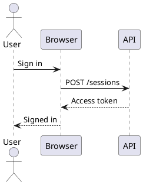

You are a senior TypeScript, React, Docusaurus, Webpack, testing, and npm package-maintenance engineer.

Create a complete, production-ready GitHub repository for a reusable Docusaurus 3+ plugin that renders PlantUML diagrams entirely in the browser using the official `@plantuml/core` package.

Use these project variables:

```text
PACKAGE_NAME=<replace with npm package name, for example @scope/docusaurus-plugin-plantuml>
GITHUB_REPOSITORY=<replace with owner/repository>
PLUGIN_ID=plantuml-client
```

Where a variable has not been replaced, centralize it so that renaming the package or repository requires changes in as few places as possible.

Do not stop at scaffolding. Implement the package, tests, example site, documentation, CI, and npm publishing workflow. Run all available checks locally and fix failures before finishing.

# Objective

Docusaurus users must be able to write PlantUML source directly in `.md` and `.mdx` files:

````markdown

````

In the browser, the code block must be replaced with a rendered SVG diagram.

Rendering must:

* happen in the browser;
* use the official `@plantuml/core` package;
* require no Java runtime;
* require no PlantUML server, Kroki server, CDN, or external rendering service;
* work in Docusaurus production builds and the local development server;
* work when Docusaurus is deployed under a non-root `baseUrl`;
* lazy-load the relatively large PlantUML runtime only on pages containing diagrams;
* support multiple diagrams on one page without race conditions;
* support Docusaurus light and dark modes;
* preserve all ordinary, non-PlantUML code blocks.

# Hard constraints

1. Use TypeScript with strict type checking.
2. Support Docusaurus 3.x.
3. Declare appropriate Docusaurus and React peer dependencies rather than bundling duplicate framework copies.
4. Do not load scripts, fonts, WASM, or other resources from a public CDN.
5. Do not render diagrams during static-site generation.
6. Do not import browser-only PlantUML code into the Node.js server bundle.
7. Do not use a remote PlantUML HTTP endpoint as a fallback.
8. Do not use a long-lived npm publishing token in GitHub Actions.
9. Do not silently swallow rendering errors.
10. Do not invent undocumented `@plantuml/core` APIs. Inspect the installed package and implement an adapter against its actual public API.

# Preferred Docusaurus integration

Implement the package as a Docusaurus plugin that provides a theme component for `MDXComponents/Code`.

The plugin should:

* expose a default Docusaurus plugin function;
* provide its theme components through the supported Docusaurus plugin/theme mechanism;
* wrap `@theme-original/MDXComponents/Code`;
* recognize fenced code blocks whose language is `plantuml` or `puml`;
* delegate every other code block to the original Docusaurus implementation without changing its behavior;
* avoid requiring users to manually swizzle files into their own repositories.

Expected consumer configuration:

```ts
// docusaurus.config.ts
import type {Config} from '@docusaurus/types';

const config: Config = {
  plugins: [
    [
      'PACKAGE_NAME',
      {
        languages: ['plantuml', 'puml'],
        theme: 'auto',
        lazy: true,
        cache: 'memory',
        sanitizeSvg: true,
        showSourceOnError: true,
        renderTimeoutMs: 20_000,
      },
    ],
  ],
};

export default config;
```

First prove this theme-wrapper design with integration tests against Docusaurus 3.

A fallback design using a Remark transformation plus a packaged React component is permitted only when the preferred theme-component approach cannot be made reliable across Docusaurus 3.x. In that case:

* document the compatibility problem in an architecture decision record;
* preserve the fenced-code authoring syntax;
* keep the consumer configuration as small as reasonably possible;
* support both docs and blog content;
* retain all other requirements in this prompt.

Do not switch architecture merely because the fallback is easier.

# Browser renderer architecture

Create a small internal adapter around `@plantuml/core`.

## Runtime assets

The official runtime includes at least:

* `plantuml.js`, an ES module;
* `viz-global.js`, which must execute as a classic script before PlantUML rendering.

Package these assets into the Docusaurus Webpack output from the installed `@plantuml/core` dependency.

Requirements:

* assets must be served from the same Docusaurus origin;
* paths must respect Docusaurus `baseUrl`;
* asset URLs must work in development and production;
* asset filenames or directories should include a package or PlantUML version to avoid stale caches;
* no fixed `/assets/...` path that breaks subpath deployments;
* the browser must not contact unpkg, jsDelivr, plantuml.com, or any other third-party host.

Use a supported Webpack/Docusaurus mechanism such as an asset module or copy plugin. Verify the result by inspecting the production bundle and exercising it in a browser test.

## Lazy loader

Implement a singleton loader that:

1. injects `viz-global.js` as a classic `<script>` element;
2. deduplicates concurrent load attempts;
3. waits for the script to load before importing `plantuml.js`;
4. dynamically imports the PlantUML module in the browser;
5. exposes clear load errors;
6. enforces a configurable timeout;
7. never runs during SSR;
8. does not add duplicate script tags after client-side navigation.

The PlantUML runtime must not appear in the initial JavaScript bundle for pages without PlantUML diagrams.

## Serialized render queue

The PlantUML JavaScript engine has shared asynchronous state when used in one browser context. Implement a module-level FIFO queue so only one render operation runs at a time.

The queue must:

* continue processing after a failed render;
* avoid one rejected task permanently breaking the queue;
* allow components to ignore results after unmounting;
* support multiple diagrams mounted simultaneously;
* include timeout protection;
* be covered by concurrency tests.

Inspect the actual `@plantuml/core` API.

Prefer a string-returning API when it supports all required options. When dark-mode rendering is only available through the DOM-oriented `render()` API, wrap it safely:

1. create a unique temporary render target;
2. call `render(lines, targetId, {dark})`;
3. detect completion with a `MutationObserver`;
4. extract the SVG;
5. clean up the observer and temporary element;
6. resolve or reject the queued Promise;
7. remove all temporary DOM elements in success, error, timeout, and unmount cases.

Do not assume that `renderToString` supports options unless verified from the installed package.

## Caching

Cache rendered SVG output using a deterministic key containing:

* PlantUML source;
* dark/light mode;
* relevant rendering options;
* the installed `@plantuml/core` version.

Support:

```ts
type CacheMode = 'none' | 'memory' | 'session';
```

Default to `memory`.

Requirements:

* session storage failures must not break rendering;
* corrupt cache values must be ignored;
* do not store unbounded data without a documented limit or eviction approach;
* changing color mode must not return the previous mode’s cached SVG.

# React component behavior

Implement a dedicated `PlantUmlDiagram` component.

It must provide these states:

* idle or deferred;
* loading runtime;
* rendering;
* rendered;
* error.

Use `IntersectionObserver` for lazy rendering when `lazy` is enabled. Include a reasonable fallback for browsers or test environments without `IntersectionObserver`.

## Dark mode

Integrate with Docusaurus color mode through its supported React API.

When the site switches between light and dark mode:

* render the corresponding diagram theme;
* use a mode-specific cache key;
* avoid stale results from a previous render replacing the newer result;
* do not reload the PlantUML engine unnecessarily.

## Accessibility

Render semantic and accessible markup:

```html
<figure>
  <div role="img" aria-label="...">...</div>
  <figcaption>...</figcaption>
</figure>
```

Requirements:

* use the code-fence title as the accessible label and optional caption when available;
* provide a useful default label such as `PlantUML diagram`;
* expose loading status accessibly without creating excessive screen-reader announcements;
* provide readable error text;
* include the original source in a `<noscript>` fallback;
* do not rely only on color to indicate failure.

Support code-fence metadata such as:

````markdown
```plantuml title="Authentication sequence"
...
```
````

Use the Docusaurus 3 code-block props actually provided at that extension point. Add unit and integration tests for metadata handling.

## SVG insertion and security

The rendered SVG will need to be inserted into the page.

Treat it as untrusted markup by default:

* sanitize the SVG before inserting it;
* use an SVG-capable sanitizer such as DOMPurify with an appropriate SVG profile;
* remove scripts, event-handler attributes, dangerous URLs, foreign HTML, and other executable content;
* preserve normal PlantUML SVG elements, styles, text, links, markers, and accessibility attributes where safe;
* provide `sanitizeSvg: false` only as an explicitly documented opt-out;
* document the trust implications of disabling sanitization.

Add focused security tests using malicious or synthetic SVG strings. Tests must prove that script elements, event handlers, and `javascript:` URLs are removed.

## Errors

On rendering failure:

* show a concise error panel;
* include enough information to diagnose invalid PlantUML;
* optionally expose the original source in a `<details>` element;
* never crash the entire Docusaurus page;
* never leave the queue blocked;
* provide stable `data-*` attributes for tests.

Recommended attributes:

```text
data-plantuml-diagram
data-plantuml-status="loading|rendering|ready|error"
data-plantuml-theme="light|dark"
```

# Public API

Provide exported TypeScript types for plugin options.

At minimum:

```ts
export interface PlantUmlPluginOptions {
  languages?: string[];
  theme?: 'auto' | 'light' | 'dark';
  lazy?: boolean;
  cache?: 'none' | 'memory' | 'session';
  sanitizeSvg?: boolean;
  showSourceOnError?: boolean;
  renderTimeoutMs?: number;
}
```

Validate plugin options during Docusaurus configuration. Fail early with useful messages for invalid values.

Choose sensible defaults and document them.

Keep internal renderer and queue APIs private unless there is a clear supported use case.

# Repository structure

Create a clean repository resembling:

```text
.
├── .changeset/ or equivalent release metadata
├── .github/
│   ├── dependabot.yml
│   └── workflows/
│       ├── ci.yml
│       └── publish.yml
├── docs/
│   └── architecture.md
├── examples/
│   └── docusaurus/
│       ├── docs/
│       │   ├── plantuml.md
│       │   ├── plantuml-mdx.mdx
│       │   ├── multiple-diagrams.md
│       │   ├── invalid-diagram.md
│       │   └── ordinary-code.md
│       ├── docusaurus.config.ts
│       ├── package.json
│       └── ...
├── scripts/
│   ├── verify-package.mjs
│   ├── test-packed-example.mjs
│   └── verify-tag-version.mjs
├── src/
│   ├── index.ts
│   ├── options.ts
│   ├── runtime/
│   │   ├── assetLoader.ts
│   │   ├── cache.ts
│   │   ├── queue.ts
│   │   ├── renderer.ts
│   │   └── sanitize.ts
│   └── theme/
│       ├── MDXComponents/
│       │   └── Code/
│       │       └── index.tsx
│       └── PlantUmlDiagram/
│           ├── index.tsx
│           └── styles.module.css
├── tests/
│   ├── unit/
│   ├── integration/
│   └── e2e/
├── CHANGELOG.md
├── CONTRIBUTING.md
├── LICENSE
├── README.md
├── SECURITY.md
├── package.json
├── package-lock.json
├── tsconfig.json
└── vitest.config.ts
```

Adjust the exact structure when required by the build tool, but keep responsibilities separated.

# Build and package configuration

Use a maintainable TypeScript package build tool such as `tsup`, Rollup, or an equivalent.

The published package must include:

* compiled JavaScript;
* TypeScript declarations;
* Docusaurus theme components;
* styles;
* package metadata;
* README;
* LICENSE.

It must not include:

* tests;
* example build output;
* Playwright browsers;
* coverage output;
* temporary package tarballs;
* development-only source maps unless intentionally documented;
* unrelated repository files.

Provide an explicit `exports` map.

Support ESM and CommonJS consumers when practical. At minimum, ensure the package works from both `docusaurus.config.ts` and standard JavaScript Docusaurus configuration supported by Docusaurus 3.

Use `npm pack` as part of verification. Install the generated tarball into a clean test site; do not let the main integration test pass only because of workspace symlinks or direct source imports.

Recommended scripts:

```json
{
  "scripts": {
    "clean": "...",
    "build": "...",
    "typecheck": "...",
    "lint": "...",
    "format:check": "...",
    "test": "...",
    "test:unit": "...",
    "test:integration": "...",
    "test:e2e": "...",
    "test:all": "...",
    "pack:check": "...",
    "example:build": "...",
    "example:serve": "..."
  }
}
```

Use exact commands appropriate to the implementation.

# Test requirements

Use Vitest or Jest for unit/component tests and Playwright for real-browser tests.

Tests must be deterministic and must not call external PlantUML services.

## Unit tests

Cover at least:

1. language detection for `plantuml` and `puml`;
2. case-sensitivity behavior, matching the documented contract;
3. delegation of ordinary code blocks;
4. extraction of code-fence source;
5. title and metadata extraction;
6. plugin option defaults and validation;
7. singleton asset loading;
8. concurrent asset-loader calls;
9. loader failure and retry policy;
10. FIFO rendering;
11. multiple simultaneous render requests;
12. queue continuation after a failed render;
13. timeout behavior;
14. component unmount during rendering;
15. light and dark cache separation;
16. memory cache behavior;
17. session-storage failure handling;
18. corrupt session-cache handling;
19. SVG sanitization;
20. loading, ready, and error UI;
21. SSR rendering without browser globals;
22. `IntersectionObserver` behavior and fallback.

Mock the renderer in component tests. Test the real `@plantuml/core` engine in browser integration tests.

## Full Docusaurus generation loop

Create an integration script that:

1. builds the npm package;
2. runs `npm pack`;
3. creates or copies a clean Docusaurus fixture into a temporary directory;
4. installs the generated `.tgz` package rather than linking the source workspace;
5. installs the fixture dependencies;
6. runs a full `docusaurus build`;
7. starts `docusaurus serve` on an available local port;
8. runs Playwright against the generated production site;
9. stops the server reliably even after a test failure;
10. prints useful logs when the build or browser test fails.

The fixture must use a non-root deployment path, for example:

```ts
url: 'https://example.test',
baseUrl: '/plantuml-test/',
```

## Example diagrams

Include tests for:

* a sequence diagram;
* a class or component diagram that exercises Graphviz layout;
* two or more diagrams on one page;
* diagrams in `.md`;
* diagrams in `.mdx`;
* a `puml` alias;
* title metadata;
* an invalid PlantUML diagram;
* a normal JavaScript or TypeScript code block;
* a page with no PlantUML block.

## Playwright assertions

The browser tests must verify:

* a real `<svg>` is rendered;
* SVG text includes expected diagram labels;
* multiple diagrams render successfully on the same page;
* the generated SVG is inside the expected PlantUML container;
* PlantUML code blocks are replaced;
* normal code blocks remain normal code blocks;
* an invalid diagram produces the documented error state;
* toggling Docusaurus dark mode causes an appropriate re-render;
* client-side navigation away from and back to a diagram page still works;
* the runtime script is not loaded on a page without diagrams;
* the runtime script is loaded at most once when diagrams are present;
* all runtime asset URLs include the configured `baseUrl`;
* no request is sent to an external PlantUML server or public CDN;
* there are no unexpected browser console errors;
* the production build hydrates without React mismatch warnings.

Do not use screenshots as the only assertion. Screenshots may be added as supplementary diagnostics.

# Docusaurus compatibility testing

The package must support Docusaurus 3.x.

In CI, run compatibility tests against:

* the oldest Docusaurus 3 version the project explicitly supports;
* the current pinned version used by the example;
* the latest available Docusaurus 3 version.

Do not accidentally test against a future Docusaurus 4 release when using a floating version. Resolve the latest matching `3.x` version explicitly.

Use Node.js versions compatible with the selected Docusaurus versions. Include at least Node.js 20 and a current Node.js LTS/current release in the CI matrix.

It is acceptable to run the expensive Playwright suite only once per relevant Docusaurus version while running unit, lint, type, and build checks across the broader Node matrix.

# GitHub Actions CI

Create `.github/workflows/ci.yml`.

Trigger it for:

* pull requests;
* pushes to the default branch;
* manual dispatch.

Use GitHub-hosted Ubuntu runners.

Set minimal permissions:

```yaml
permissions:
  contents: read
```

Include jobs for:

1. formatting, linting, and type checking;
2. unit and component tests with coverage;
3. package build;
4. `npm pack` content verification;
5. full packed-package Docusaurus build;
6. Playwright browser tests;
7. Docusaurus 3 compatibility matrix.

Use:

* `npm ci` for lockfile-based installs;
* dependency caching only where it is safe;
* concurrency cancellation for superseded branch or PR runs;
* uploaded build logs or Playwright traces on failure;
* explicit timeouts so hung renders cannot consume the runner indefinitely.

The CI workflow must execute the same scripts documented for local development.

# npm trusted publishing workflow

Create `.github/workflows/publish.yml`.

Use npm trusted publishing through GitHub Actions OIDC.

Requirements:

* use a GitHub-hosted runner;
* use Node.js 24 or another version satisfying current npm trusted-publishing requirements;
* ensure npm CLI is at least the minimum version required for trusted publishing;
* use current stable major versions of official GitHub actions;
* set exactly the permissions needed:

```yaml
permissions:
  contents: read
  id-token: write
```

* configure the npm registry with `actions/setup-node`;
* do not set `NODE_AUTH_TOKEN`;
* do not reference an npm write-token secret;
* do not place a token in `.npmrc`;
* run a clean installation;
* run formatting checks, linting, type checking, tests, package build, package verification, and the packed-package Docusaurus integration test before publishing;
* verify that a tag such as `v1.2.3` exactly matches `package.json` version `1.2.3`;
* reject dirty or inconsistent release contents;
* run `npm publish --access public`;
* rely on npm trusted publishing for automatic provenance rather than manually managing a provenance token;
* use an npm GitHub environment named `npm` so maintainers can configure approval protection;
* use release concurrency to prevent duplicate publication;
* ensure prerelease versions use an appropriate non-`latest` dist-tag such as `next` or `beta`.

Choose one clear release trigger and document it. Prefer publishing when a GitHub Release is published or when a version tag is pushed. Ensure the trigger matches the npm trusted-publisher configuration described in the README.

Add a release dry-run or `npm pack` inspection before the publish command.

The workflow filename must remain exactly `publish.yml`, because npm’s trusted-publisher configuration is tied to the workflow filename.

# npm trusted-publisher setup documentation

The README must include a maintainer section describing the one-time npmjs.com setup:

1. create the npm package or publish its initial version through an appropriate bootstrap process;
2. open the package settings on npmjs.com;
3. configure GitHub Actions as the trusted publisher;
4. enter the exact GitHub owner and repository;
5. enter `publish.yml` as the workflow filename, not the full path;
6. configure the `npm` environment name when used;
7. allow `npm publish`, or document staged publishing when selected;
8. confirm that `package.json.repository.url` exactly matches the GitHub repository;
9. enable publishing-access restrictions after trusted publishing is verified;
10. remove obsolete automation tokens.

Explain that trusted publishing authenticates publication, but it does not provide credentials for installing private dependencies. Do not add a read token unless the repository actually needs private packages.

# README requirements

Write a complete README containing:

* project purpose;
* status and compatibility statement;
* installation;
* minimal Docusaurus 3 configuration;
* `.md` and `.mdx` examples;
* all plugin options and defaults;
* light/dark mode behavior;
* lazy-loading behavior;
* caching behavior;
* accessibility behavior;
* SVG sanitization and security model;
* error behavior;
* supported PlantUML fence aliases;
* Docusaurus `baseUrl` support;
* browser compatibility expectations;
* bundle-size implications;
* Content Security Policy considerations, including any directive required by the PlantUML Graphviz/WASM runtime;
* development commands;
* test strategy;
* release process;
* npm trusted-publisher setup;
* limitations;
* troubleshooting.

Troubleshooting should cover:

* PlantUML assets returning 404 under a subpath;
* an incorrect Docusaurus `baseUrl`;
* reverse proxies rewriting asset paths;
* reverse proxies serving JavaScript with the wrong MIME type;
* restrictive Content Security Policy settings;
* corporate proxies affecting `npm install` or GitHub Actions dependency installation;
* browser extensions blocking worker or WASM execution;
* duplicate or mismatched Docusaurus/React dependencies;
* invalid PlantUML source;
* stale browser or service-worker caches.

Clearly state that runtime rendering is same-origin and does not send diagram source to an external service.

# Additional repository files

Include:

* MIT `LICENSE`;
* `CONTRIBUTING.md` with setup, testing, commit, and PR guidance;
* `SECURITY.md` with a private reporting process placeholder;
* `CHANGELOG.md`;
* dependency-update configuration;
* `.editorconfig`;
* `.gitignore`;
* Prettier and ESLint configuration;
* a sensible Node engine declaration;
* optional `.nvmrc` or `.node-version`;
* architecture documentation explaining SSR boundaries, asset loading, the render queue, caching, sanitization, and dark-mode re-rendering.

Add comments only where they clarify non-obvious behavior. Avoid comments that merely repeat the code.

# Package verification

Create a script that examines `npm pack --json` output and fails when:

* required compiled files are missing;
* type declarations are missing;
* README or LICENSE is missing;
* source maps or test files are unintentionally included;
* example build output is included;
* the package is unexpectedly large without explanation;
* `package.json` exports point to missing files.

The script should print the packed file list and compressed/unpacked sizes.

# Quality requirements

* No `any` types without a documented reason.
* No disabled TypeScript errors.
* No committed generated Docusaurus build output.
* No dependence on globally installed tools.
* No test that passes only because of test execution order.
* No flaky fixed-duration sleeps when an event, process output, MutationObserver, or Playwright locator can be awaited.
* No unbounded event listeners or MutationObservers.
* No state update after component unmount.
* No duplicate loading of `viz-global.js`.
* No remote network dependency in runtime tests.
* No package publication from a pull-request workflow.
* No secrets exposed to pull requests.
* No npm publish command before all release checks pass.

# Acceptance criteria

The implementation is complete only when all of the following are true:

1. `npm ci` succeeds from a fresh clone.
2. `npm run build` succeeds.
3. `npm run typecheck` succeeds.
4. `npm run lint` succeeds.
5. `npm test` succeeds.
6. The package can be packed with `npm pack`.
7. The package-content verification succeeds.
8. A clean Docusaurus 3 fixture can install the generated tarball.
9. `docusaurus build` succeeds for the fixture.
10. The production fixture can be served locally.
11. Playwright observes real SVG diagrams rendered by `@plantuml/core`.
12. Multiple diagrams render correctly on one page.
13. Graphviz-dependent diagrams render successfully.
14. `.md` and `.mdx` examples both work.
15. Dark-mode switching works.
16. A non-root `baseUrl` works.
17. Invalid PlantUML produces a contained error state.
18. Normal code blocks are unchanged.
19. A page without diagrams does not load the PlantUML runtime.
20. Browser requests show no external rendering or CDN calls.
21. Sanitization tests remove executable SVG content.
22. CI performs the packed-package full-build test.
23. `publish.yml` uses OIDC and contains no npm publishing token.
24. The README explains the complete installation, security, testing, and release process.
25. The repository contains no obvious placeholders except the package name, GitHub repository, security contact, and npm ownership details that cannot be inferred.

# Working method

Proceed autonomously.

Before implementation:

1. inspect the current public APIs of Docusaurus 3 and the installed `@plantuml/core` package;
2. write a concise architecture note;
3. create a minimal spike proving that the selected Docusaurus extension point receives the expected code-block props;
4. prove that the official PlantUML browser engine can render a sequence diagram and a Graphviz-dependent diagram.

Then implement the complete repository.

When a technical assumption proves false, adapt the design, add a regression test, and document the decision. Do not omit functionality silently.

At completion, provide:

* a concise architecture summary;
* the final repository tree;
* commands executed;
* test results;
* package tarball contents and size;
* any remaining limitations;
* exact one-time npmjs.com trusted-publisher steps;
* confirmation that runtime rendering makes no external network request;
* confirmation that the GitHub Actions publishing workflow contains no long-lived npm token.

