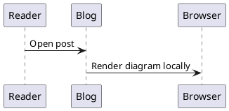

Because the plugin extends the shared `MDXComponents/Code` component, diagrams work in blog
posts exactly as they do in docs.

<!-- truncate -->

```plantuml title="Blog post diagram"
@startuml
Reader -> Blog : Open post
Blog -> Browser : Render diagram locally
@enduml
```
