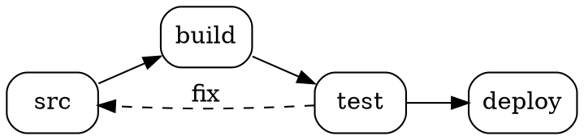
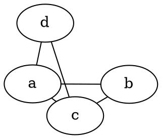
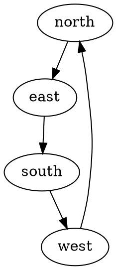
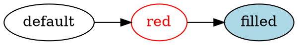
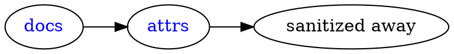
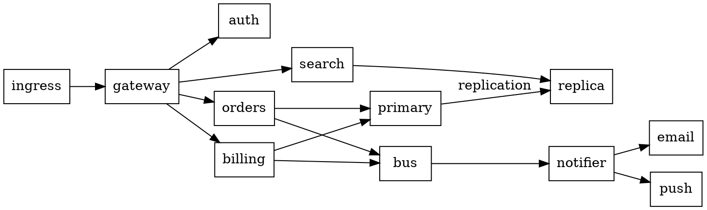
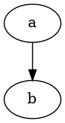
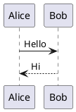

# Graphviz diagrams

`dot`, `graphviz` and `gv` fences are laid out by Graphviz in the browser, using the same
engine PlantUML already uses for its own layout — so a site that renders PlantUML pays no
extra bytes for these.

## A plain DOT graph



## Choosing a layout engine

Any fence can pick a different layout engine with `engine=`. The same graph laid out by
`neato` rather than `dot`:



And `circo`, which arranges nodes on a circle:



## Colours from the diagram source always win

The default black strokes and text follow the page's text colour, so the graph is readable in
both colour modes. Anything the DOT source colours explicitly is left exactly as authored —
toggle the theme and watch the red and blue nodes stay put.



## Hyperlinks

DOT's `URL` attribute becomes a real link in the rendered SVG. It is sanitized like every
other piece of engine output, so a `javascript:` URL never survives.

The `hostile` node below deliberately carries a `javascript:` URL. It is here so the end-to-end
suite can prove that sanitization removes it from the rendered page — the node still draws, but
its link does not survive.



## Zoom works the same as it does for PlantUML



A fence can opt out of zoom exactly as a PlantUML fence can:



## An invalid diagram

Graphviz reports the offending line, and the plugin shows it rather than a generic failure.

```dot title="Deliberately broken"
digraph {
  a -> ;
}
```

## Ordinary code blocks are untouched

A fence in another language still renders as code, with highlighting intact:

```json
{"this": "is not a diagram"}
```

## Both engines on one page


