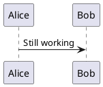

# Invalid PlantUML

An unparseable diagram produces a contained error panel. The rest of the page keeps
working, and the queue keeps processing later diagrams.

```plantuml title="Broken on purpose"
@startuml
this is definitely not valid ###
Alice ->
@enduml
```

A valid diagram after the broken one still renders, which proves the render queue recovers
from a failure:


