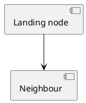

# Link target

The landing page for the cross-page diagram links on [Links and deep links](./links.md).
Nodes on that page link here with `#graph?highlight-node=TARGET_NODE_7`, which the diagram
below contains.

