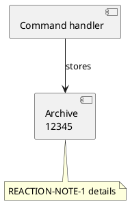
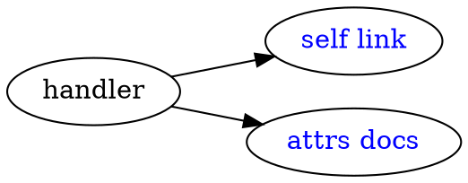

# Links and deep links

Several nodes on this page are addressable through `#graph?highlight-node=…` deep links.
The end-to-end suite drives this page; the identifiers are part of its contract.

The PlantUML component below is addressed by its **alias** — `MESSAGE_MY_GREAT_COMMAND`
never appears in the picture, but the engine writes it into the SVG as
`data-qualified-name`. The note is aliased and addressable the same way.

[Focus the command handler](#graph?highlight-node=MESSAGE_MY_GREAT_COMMAND) to highlight a
node, then [clear the highlight](./links.md) without leaving the page — the second link is a
router navigation that drops the hash, which must sweep the highlight.

The Graphviz diagram uses an explicit node `id`, a self-anchor (`URL="#graph?…"`) whose
click mints the node's own permalink, and an external link.

