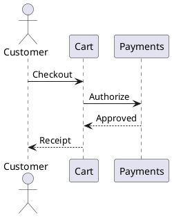
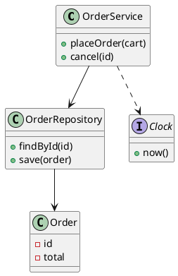
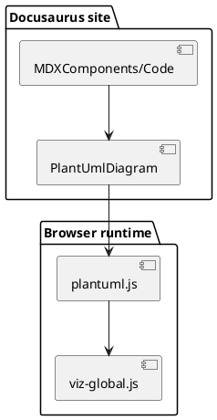

# Several diagrams on one page

Diagrams are rendered one at a time by a shared queue, so a page can hold as many as it
needs without the engine's shared state being corrupted.

## Sequence

## Class diagram (Graphviz layout)

This one goes through the bundled Graphviz layout engine rather than PlantUML's built-in
sequence layout.

## Component diagram

