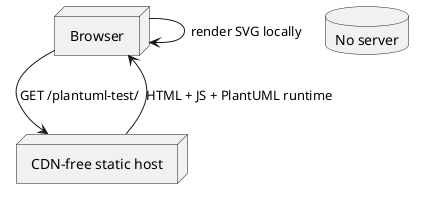
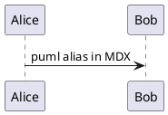

import Admonition from '@theme/Admonition';

# Diagram in an MDX document

<Admonition type="info" title="MDX">
  The same fence syntax works in `.mdx` files, alongside JSX components.
</Admonition>

The `puml` alias works here too:

