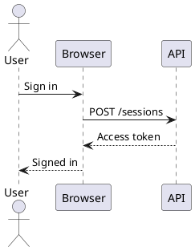

# Sequence diagram in Markdown

A `plantuml` fence with a `title` becomes a rendered diagram with a caption.

```plantuml title="Authentication sequence"
@startuml
actor User
participant Browser
participant API

User -> Browser: Sign in
Browser -> API: POST /sessions
API --> Browser: Access token
Browser --> User: Signed in
@enduml
```

The diagram above is rendered in your browser. No diagram source leaves this page.
