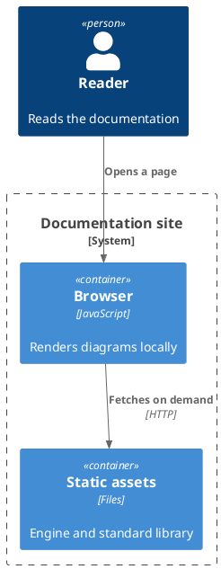
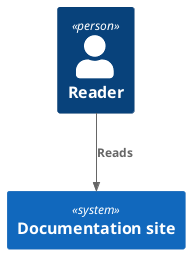
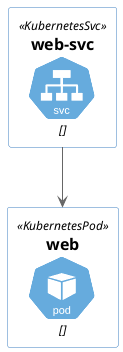

# PlantUML standard library

`!include <namespace/file>` resolves against the standard library namespaces the plugin
ships. Nothing is configured on this page: the plugin sees the include, loads the one
namespace it names, and renders.

## C4

The `.puml` suffix is accepted too, because C4-PlantUML's own documentation writes it that
way.

## A namespace that pulls in another

`k8s/Common` includes `<c4/…>` from inside the library. The dependency is resolved before the
engine ever sees the source, so the diagram does not have to know about it.

## A namespace this site does not have

`aws` is not vendored with the plugin, so this fence reports what is missing instead of
failing inside the engine.

```plantuml title="Unavailable namespace"
@startuml
!include <aws/Common>
A -> B
@enduml
```

