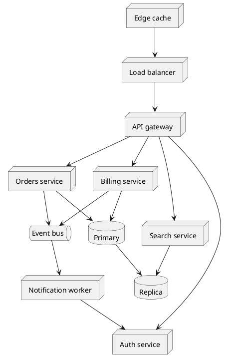
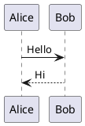

# Zoom and pan

The first diagram is deliberately wide, so it is worth zooming into. The second opts out with
`zoom=false` on its fence and renders exactly as it did before the feature existed.

## Opted out

