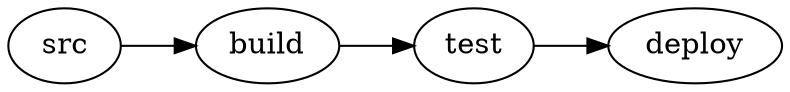
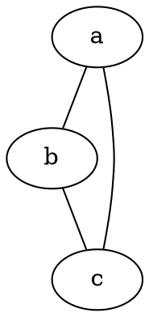

# Graphviz/DOT diagrams in Docusaurus — options, feasibility and recommendation

Status: proposal / discussion document
Date: 2026-08-06
Author: research report for `@matfsw/docusaurus-plantuml-plugin`

---

## 1. Executive summary

**Yes, it is feasible — and it is much easier than PlantUML was.**

The single most important finding of this research is not about which WebAssembly build to
pick. It is this:

> **This plugin already ships a complete, working, browser-side Graphviz.**
> `@plantuml/core` bundles `viz-global.js`, which is **Viz.js 3.24.0 containing Graphviz
> 14.1.1**. The plugin already copies it into the site build and already loads it as a classic
> script into `window.Viz` before `plantuml.js` — because PlantUML needs Graphviz for its own
> layout. `window.Viz.instance()` is a fully-featured Graphviz that renders DOT to SVG.

I verified this empirically (method and raw numbers in [Appendix A](#appendix-a--measurements)):

| Measurement                                                 | Result                                                                                                |
| ----------------------------------------------------------- | ----------------------------------------------------------------------------------------------------- |
| Graphviz version in the already-shipped asset               | **14.1.1**                                                                                            |
| Layout engines available                                    | `circo dot fdp neato nop nop1 nop2 osage patchwork sfdp twopi`                                        |
| Engine init (`Viz.instance()`)                              | **~15 ms**                                                                                            |
| Small graph (3 nodes, 4 edges) → SVG                        | **~10 ms**                                                                                            |
| Medium graph (300 edges) → SVG                              | **26 ms**, 175 KB                                                                                     |
| Large graph (3 000 edges) → SVG                             | **2 252 ms**, 1.8 MB                                                                                  |
| 200 renders on one instance, 20 of them syntax errors       | **48 ms total**, instance healthy afterwards                                                          |
| Error reporting                                             | structured: `{status:'failure', errors:[{level:'error', message:"syntax error in line 1 near '}'"}]}` |
| Extra bytes shipped to a site that already uses this plugin | **0**                                                                                                 |

**Recommendation: Option A — add DOT support to _this_ plugin, reusing the already-bundled
`viz-global.js`, behind a new `graphviz` option group.**

The decisive argument is not convenience, it is correctness: per
[ADR 0001](docs/adr/0001-theme-init-alias.md), **two plugins that both wrap
`MDXComponents/Code` cannot coexist in Docusaurus 3.** Shipping Graphviz as a _separate_
package would mean a user who installs both plugins silently loses one of them. That failure
mode is unacceptable, and it rules out the "separate package" shape unless the shared
code-block interception is factored out first.

There is one honest caveat I want on the record before the detail:
[§7.1 — build-time rendering is technically the better answer for Graphviz](#71-the-case-against-browser-rendering-read-this-one),
even though it is not what you asked for. I recommend browser-first as requested, with
build-time pre-rendering as a later opt-in.

---

## 2. Does something like this already exist?

**Short answer: no, not for Docusaurus.** The npm names are free and nothing fills the niche.

### 2.1 Docusaurus-specific packages — none exist

| Package name                 | Status on npm         |
| ---------------------------- | --------------------- |
| `docusaurus-plugin-graphviz` | **404 — unpublished** |
| `docusaurus-graphviz`        | **404 — unpublished** |
| `docusaurus-theme-graphviz`  | **404 — unpublished** |
| `docusaurus-plugin-dot`      | **404 — unpublished** |

Docusaurus ships **Mermaid** support natively (`@docusaurus/theme-mermaid`, enabled with
`markdown.mermaid: true`). Mermaid is not Graphviz: it has its own layout engine and its own
DSL, and it cannot consume DOT. There is no first-party or well-known third-party DOT support.

`Arsero/docusaurus-graph` sounds relevant but is not — it generates a _graph view of your docs'
link structure_, not a DOT renderer.

### 2.2 Generic remark/rehype plugins — exist, but all are poor fits

| Package                  | Version | Last published | Engine                   | Why it does not fit                                                                                                                                                         |
| ------------------------ | ------- | -------------- | ------------------------ | --------------------------------------------------------------------------------------------------------------------------------------------------------------------------- |
| `remark-graphviz`        | 0.2.2   | 2022-06        | `viz.js@^1.3.0`          | Build-time only; viz.js 1.x is asm.js from the pre-WASM era and long archived; unmaintained                                                                                 |
| `remark-graphviz-svg`    | 0.2.0   | 2022-05        | `@hpcc-js/wasm@^1.x`     | Build-time only; unmaintained; pins a `@hpcc-js/wasm` major that is two majors behind                                                                                       |
| `rehype-graphviz`        | 0.3.0   | 2024-06        | `@hpcc-js/wasm` (peer)   | Build-time only, but the most modern of the three. Genuinely usable as a _build-time_ option — see [Option C](#option-c--build-time-rendering-via-a-remarkrehype-transform) |
| `remark-kroki-plugin`    | 0.1.1   | 2022-05        | Kroki HTTP service       | Server round-trip per diagram at build time; unmaintained                                                                                                                   |
| `gatsby-remark-graphviz` | —       | —              | native `graphviz` binary | Gatsby-only; requires a system Graphviz install                                                                                                                             |

Every one of these renders at **build time**. **None of them renders in the browser.** None
integrates with Docusaurus' colour mode, and none gives you the zoom/pan/maximize UI this
plugin already has.

**Conclusion: the niche you are describing — browser-rendered, zero-install, dark-mode-aware,
zoomable DOT diagrams in Docusaurus — is genuinely unoccupied.**

---

## 3. Is browser-based rendering feasible?

Yes, comfortably. Graphviz-to-WebAssembly is a mature, well-trodden path — considerably more so
than PlantUML-to-JavaScript was.

Three things make this materially easier than the PlantUML integration:

1. **The engine is small.** ~0.8–1.4 MB single file, versus PlantUML's 8 MB across two files.
2. **Rendering is synchronous and re-entrant-safe.** `viz.renderString()` returns a string
   directly. There is **no callback protocol, no in-flight global state, and therefore no need
   for the serialized FIFO queue** that `runtime/queue.ts` exists to provide. I ran 200 renders
   back-to-back on one instance — including 20 deliberate syntax errors interleaved — and every
   subsequent render succeeded. The engine does not need to be re-instantiated after an error.
3. **Errors are structured.** Graphviz returns `{status: 'failure', errors: [{level, message}]}`
   with line numbers. Compare
   [ADR 0002](docs/adr/0002-render-to-string.md), where PlantUML forced you to _sniff the
   rendered SVG for error-picture markers_. You can show the reader `syntax error in line 7
near '}'` instead of a generic failure panel — a genuine UX improvement over the PlantUML
   path.

The one real constraint: **rendering is synchronous, so it blocks the main thread.** A 300-edge
graph costs 26 ms (imperceptible). A 3 000-edge graph costs 2.25 s (a visible freeze). See
[§8.2](#82-main-thread-blocking-on-very-large-graphs) for the mitigation.

---

## 4. Engine options

### 4.1 Option 1 — reuse `viz-global.js` already inside `@plantuml/core` ★

| Property          | Value                                                                                                                     |
| ----------------- | ------------------------------------------------------------------------------------------------------------------------- |
| What it is        | Viz.js 3.24.0, Graphviz **14.1.1**                                                                                        |
| Size              | 1 445 436 B (already emitted by this plugin today)                                                                        |
| **Marginal cost** | **0 bytes, 0 new dependencies, 0 new build plumbing**                                                                     |
| Packaging         | Single file, wasm embedded as a `data:application/octet-stream;base64` URI. No external `.wasm`, no CDN, no network fetch |
| Already loaded?   | **Yes** — `runtime/assetLoader.ts` injects it as a classic script _before_ `plantuml.js` and it installs `window.Viz`     |
| Licence           | MIT (Viz.js) + EPL-1.0 (Graphviz), already in the dependency tree                                                         |
| CSP               | No `unsafe-eval` needed — same as today                                                                                   |

This is the strongest option by a wide margin for the merged design. The asset is already
downloaded, already cached, already CSP-clean, already version-pinned into the asset directory
name. Adding DOT support costs a few hundred lines of TypeScript and **not one additional byte
over the wire**.

**The risk:** it is a _transitive_ dependency. `@plantuml/core` lists `./viz-global.js` in its
`exports` and `files`, so it is a supported entry point, not a private file — but it is shipped
at PlantUML's discretion, not yours. If PlantUML ever inlines it, renames it, or swaps engines,
your DOT feature breaks with it. See [§8.1](#81-the-transitive-dependency-risk) for the
mitigation, which is cheap and makes this risk acceptable.

### 4.2 Option 2 — `@viz-js/viz` as a direct dependency

| Property  | Value                                                                                 |
| --------- | ------------------------------------------------------------------------------------- |
| Version   | 3.29.0 (actively maintained; mdaines, the Viz.js author)                              |
| Size      | `dist/viz-global.js` 1 326 330 B, `dist/viz.js` (ESM) 1 185 234 B; 4.98 MB unpacked   |
| Packaging | Single file, wasm embedded. No CDN                                                    |
| Licence   | MIT                                                                                   |
| API       | `instance() → {render, renderString, renderSVGElement, renderJSON, engines, formats}` |
| Docs      | Explicitly: _"The instance can be used to render multiple graphs."_                   |

This is the _same engine family_ as Option 1, just declared directly and one minor version
newer. It buys you independence from `@plantuml/core` at the cost of ~1.3 MB duplicated on
disk in the published package and a second near-identical asset in the site build (though
lazily loaded, so most readers never fetch both).

**This is the right engine for a standalone plugin, and the right fallback for the merged one.**

### 4.3 Option 3 — `@hpcc-js/wasm-graphviz`

| Property         | Value                                                                                                                                                                                              |
| ---------------- | -------------------------------------------------------------------------------------------------------------------------------------------------------------------------------------------------- |
| Version          | 1.28.0                                                                                                                                                                                             |
| Graphviz version | **15.1.0** — newest of the three                                                                                                                                                                   |
| Size             | `dist/index.js` **821 212 B** — the smallest option                                                                                                                                                |
| Packaging        | Single ESM file. wasm embedded as a compact ASCII-encoded string decoded into `wasmBinary`, with `locateFile: () => ""`. **Verified: no `.wasm` file in the tarball and no CDN URL in the bundle** |
| Licence          | **Apache-2.0** (note: differs from this project's MIT)                                                                                                                                             |
| API              | `Graphviz.load() → graphviz.dot(src)`; also `createGraph()` for programmatic construction, and `read`/`write`/`toDot`                                                                              |
| Errors           | **Throws** on invalid DOT rather than returning a result object                                                                                                                                    |
| Measured         | import 4 ms, load 33 ms, render 12 ms                                                                                                                                                              |

Technically excellent — smallest, newest Graphviz, richest API, backed by HPCC Systems, and it
is what `d3-graphviz` and `rehype-graphviz` build on. Its drawbacks for _this_ project are the
throwing error model (less ergonomic than `{status, errors}` for building an error panel), the
Apache-2.0 licence mixing into an MIT project, and — decisively — that it duplicates an engine
you already ship.

**Pick this only if you go standalone and want the smallest possible payload.**

### 4.4 Option 4 — `d3-graphviz`

`d3-graphviz@5.6.0` wraps `@hpcc-js/wasm` and adds **animated transitions between graphs** plus
D3 selection integration. It pulls in D3 (`d3-selection`, `d3-transition`, `d3-zoom`, …).

**Rejected.** Its headline feature is animated morphing between successive graphs, which a
static docs page never needs, and its zoom is D3's — which would collide with the zoom/pan
system this plugin already owns ([ADR 0003](docs/adr/0003-zoom-container-transform.md)). It
adds a large dependency to buy features you already have or do not want.

### 4.5 Engine comparison at a glance

|                         | Bundled `viz-global.js` ★ | `@viz-js/viz`        | `@hpcc-js/wasm-graphviz` | `d3-graphviz`       |
| ----------------------- | ------------------------- | -------------------- | ------------------------ | ------------------- |
| Graphviz version        | 14.1.1                    | 14.x (3.29.0 build)  | **15.1.0**               | via `@hpcc-js/wasm` |
| Bytes over the wire     | **0 (already there)**     | ~1.33 MB             | **~0.82 MB**             | 0.82 MB + D3        |
| New dependency          | **none**                  | 1                    | 1                        | several             |
| Self-contained (no CDN) | ✅ verified               | ✅                   | ✅ verified              | ✅                  |
| Licence                 | MIT + EPL-1.0             | MIT                  | Apache-2.0               | BSD-3 + Apache-2.0  |
| Error model             | `{status, errors[]}` ★    | `{status, errors[]}` | throws                   | throws              |
| Sync render (no queue)  | ✅                        | ✅                   | ✅                       | ✅                  |
| Risk                    | transitive dep            | low                  | low                      | dependency weight   |

---

## 5. Architectural options

### Option A — extend this plugin ★ **RECOMMENDED**

Add Graphviz as a second diagram language handled by the same `MDXComponents/Code` wrapper,
reusing the already-loaded `window.Viz`.

```
docusaurus.config.ts
  plugins: [['@matfsw/docusaurus-plantuml-plugin', {
    languages: ['plantuml', 'puml'],
    graphviz: {languages: ['dot', 'graphviz', 'gv']},
  }]]
```

**Pros**

- **Zero marginal payload.** The engine is already emitted and already loaded.
- **Solves the ADR 0001 coexistence problem by construction** — one wrapper, two languages.
- Reuses, verbatim, the machinery that took real effort to get right: the SSR boundary, the
  asset loader singleton, the cache with its version-folded key, `IntersectionObserver` laziness,
  DOMPurify sanitization, the abort/unmount discipline, and the entire zoom/pan/maximize UI.
- One package, one CHANGELOG, one CI pipeline, one docs site.
- A user who wants only DOT still gets a working, well-tested product.

**Cons**

- **Naming.** `@matfsw/docusaurus-plantuml-plugin` shipping Graphviz is a misnomer. Addressed
  in [§9](#9-naming).
- A DOT-only user downloads `plantuml.js`… **no — they do not.** `assetLoader.ts` would be split
  so `plantuml.js` loads only when a PlantUML fence is actually rendered. This is a required
  part of the work, not a drawback, and it _also_ improves the status quo.
- Slightly more surface area in `options.ts`.

### Option B — a separate `docusaurus-plugin-graphviz` package

A standalone plugin depending directly on `@viz-js/viz` or `@hpcc-js/wasm-graphviz`.

**Pros**

- Honest naming; independent versioning; DOT-only users install nothing PlantUML-related.
- The npm names are all free.

**Cons — one of them is decisive**

- 🔴 **It cannot coexist with this plugin.** Both would register a theme path providing
  `MDXComponents/Code`. Per ADR 0001, `@theme-init/X` resolves to the _first_ theme providing
  `X` — so the second plugin's delegate skips past the first plugin straight to
  `theme-classic`, and **the first plugin's diagrams silently stop rendering.** A user with both
  PlantUML and DOT diagrams gets a broken site with no error message. This is the single worst
  outcome available and it argues strongly against Option B as a _first_ step.
- Duplicates the engine (~1 MB) for anyone using both.
- Duplicates ~80 % of the code: cache, loader, sanitizer, zoom/pan, error panel, options
  validation, SSR discipline, the whole test suite.

**Option B only becomes viable after the shared code-block interception is factored out into a
common core** — see [Option E](#option-e--extract-a-shared-core-then-two-thin-plugins).

### Option C — build-time rendering via a remark/rehype transform

Render DOT to SVG in Node during the build and inline the SVG into the HTML. The Graphviz wasm
runs happily in Node (I ran every measurement in this report that way).

**Pros**

- **Zero client-side JavaScript. Zero engine download. Works with JS disabled.**
- Best possible LCP; diagrams are in the initial HTML.
- Build fails loudly on a bad diagram rather than showing a reader an error panel.
- Genuinely simpler: no loader, no cache, no queue, no SSR boundary, no abort handling.

**Cons**

- **Dark mode is harder.** With browser rendering you re-render for the other colour mode
  (the existing design). At build time you must either render both variants and toggle with CSS,
  or emit `currentColor`-friendly SVG and restyle. Solvable, but it is real work.
- Inlined SVG lands in **every page's HTML**, growing the static payload; a diagram-heavy page
  gets meaningfully larger. (The 3 000-edge graph is 1.8 MB of SVG.)
- Slower builds proportional to diagram count (though 26 ms for 300 edges means this is small
  in practice).
- Diverges from the architecture and story of the existing plugin.

**This option is not recommended as the primary path — you asked for browser rendering — but see
[§7.1](#71-the-case-against-browser-rendering-read-this-one), because it is technically the
strongest option on the merits.**

### Option D — server-side rendering behind an HTTP endpoint (Kroki or custom)

Post DOT to a service, get SVG or PNG back. [Kroki](https://kroki.io) is the obvious choice —
it speaks Graphviz, PlantUML, Mermaid and ~20 more DSLs, and is self-hostable via Docker.

**Pros**

- Trivially small client payload.
- One service covers Graphviz _and_ PlantUML _and_ everything else, with a single integration.
- Access to output formats WebAssembly builds do not do well (PDF, high-DPI PNG).

**Cons**

- 🔴 **It abandons the plugin's entire value proposition.** The package description is _"no
  Java, no PlantUML server, no CDN."_ Adding a server dependency for Graphviz — which
  demonstrably needs none — is a strict regression.
- Operational burden: uptime, CORS, rate limits, a service outage breaking the docs.
- Privacy: diagram source leaves the machine. Disqualifying for many internal docs.
- Slower than local rendering. A network round-trip costs more than the 10 ms local render.

**Rejected.** You said a server would be acceptable; I am telling you it is not necessary. Local
rendering is 10 ms and the engine is free. There is no scenario here where a server wins.

### Option E — extract a shared core, then two thin plugins

Factor the code-block interception, cache, loader, sanitizer and zoom/pan into
`@matfsw/docusaurus-diagram-core`, then publish `…-plantuml-plugin` and `…-graphviz-plugin` as
thin adapters that _register languages with the shared core_ instead of each wrapping
`MDXComponents/Code`.

**Pros**

- Honest naming _and_ real composability — the coexistence problem is solved properly.
- Extensible: Mermaid, Vega, Structurizr, Pikchr could all be adapters later.

**Cons**

- Substantially more work: a new package, a plugin-registration protocol between packages, a
  three-package release process, and a breaking change for existing users.
- Solves a problem you do not have yet — today there is exactly one diagram language.

**Not now. Revisit if a third language ever appears.** Option A is a strict subset of the work
Option E would need, so choosing A now does not close the door on E later.

### 5.1 Options scored

|                                   | A: extend ★        | B: separate    | C: build-time | D: server | E: core + adapters |
| --------------------------------- | ------------------ | -------------- | ------------- | --------- | ------------------ |
| Marginal bytes to reader          | **0**              | ~1 MB          | **0**         | ~0        | 0                  |
| Coexists with PlantUML            | ✅ by construction | 🔴 **no**      | ✅            | ✅        | ✅                 |
| Effort                            | **low**            | medium         | medium        | medium    | high               |
| Reuses zoom/pan/cache/sanitizer   | ✅ all             | ❌ reimplement | partial       | partial   | ✅                 |
| Works without JavaScript          | ❌                 | ❌             | ✅            | ✅        | ❌                 |
| Keeps "no server, no CDN" promise | ✅                 | ✅             | ✅            | 🔴 no     | ✅                 |
| Naming honesty                    | ⚠️ poor            | ✅             | ✅            | ✅        | ✅                 |

---

## 6. Recommendation

**Do Option A with Engine Option 1: add Graphviz to this plugin, reusing the `viz-global.js`
that `@plantuml/core` already ships and that the plugin already loads.**

Sequenced:

1. **Now — Option A.** Ship DOT support in this plugin. Low effort, zero payload cost, no
   coexistence hazard, reuses everything.
2. **Next minor — the `plantuml.js` split.** Load `plantuml.js` only when a PlantUML fence
   actually renders. This makes the plugin _better for existing users too_, and makes a
   DOT-only site pay ~1.4 MB instead of ~8.6 MB.
3. **Later, optional — Option C as an opt-in `renderAt: 'build'` mode.** Best-in-class output
   for readers who want it, without changing the default.
4. **Only if a third language appears — Option E.**

---

## 7. Concerns worth stating plainly

### 7.1 The case _against_ browser rendering (read this one)

You asked for browser rendering and I am recommending it. But the reason browser rendering was
_right_ for PlantUML does not transfer to Graphviz, and you should know that before committing.

PlantUML had to run in the browser because the alternative was Java or a public server —
genuinely bad options. **Graphviz has no such problem.** The same wasm runs in Node in
milliseconds, at build time, producing pages that need no JavaScript at all.

Measured against build-time rendering, browser rendering for DOT costs you:

- ~1.4 MB of engine download (free _today_ only because PlantUML already pays for it — and it
  stops being free the moment step 2 above splits the loaders, or if a site uses only DOT)
- a visible render delay and a loading state on every page view
- no diagrams for readers without JavaScript (mitigated only by the `<noscript>` source block)
- everything in `runtime/` — loader, cache, abort handling, SSR discipline — existing purely to
  manage a problem that build-time rendering does not have

What browser rendering buys you in return is real, and it is why I still recommend it here:
**the existing zoom/pan/maximize UI, instant dark-mode re-rendering, and — above all —
architectural consistency with the plugin that already exists.** Two diagram languages behaving
differently in the same plugin would be worse than either choice made consistently.

**Proceeding as you asked.** The `renderAt: 'build' | 'client'` option in step 3 is how you keep
the door open cheaply — the renderer module is engine-agnostic about _where_ it runs.

### 7.2 Ship dark mode as `currentColor`, not as a re-render

PlantUML has a real dark theme, so re-rendering on colour-mode change is correct there.
**Graphviz has no dark mode.** DOT output is black-on-white unless the author says otherwise.

Do not fake it by re-rendering with injected colour attributes — that fights authors who set
their own colours, and it doubles the cache. Instead:

- Default `graphAttributes: {bgcolor: 'transparent'}` so the diagram sits on the page background.
- Ship CSS that maps Graphviz's default black strokes/fills to `currentColor` in dark mode,
  scoped to `[data-graphviz-diagram] svg`.
- Give authors an explicit escape hatch: colours set in the DOT source always win.

Consequence: **the colour mode does not belong in the Graphviz cache key** (unlike PlantUML's),
and toggling dark mode triggers no re-render at all. That is strictly better behaviour.

### 7.3 Do not build a queue

`runtime/queue.ts` exists because PlantUML's engine keeps in-flight state in module globals and
three concurrent renders produced _one callback and two permanent hangs_. **Graphviz has no such
defect** — `renderString` is synchronous and returns before anything else can run. Reusing the
queue for DOT would add latency and complexity for nothing. Route DOT around it.

---

## 8. Risks and mitigations

### 8.1 The transitive-dependency risk

**Risk:** `viz-global.js` is shipped by `@plantuml/core` for PlantUML's benefit. It is a
declared export (`"./viz-global.js"` is in their `exports` and `files`), so it is supported, not
private — but a future `@plantuml/core` could inline it, rename it, or replace the engine, and
your DOT feature would break on a routine dependency bump.

**Mitigations (all cheap, do all three):**

1. **Fail at build time, not in the browser.** `locatePlantUmlCore()` already resolves the file
   path in Node. Extend it to assert `viz-global.js` exists, and fail the build with an
   actionable message if it does not. A dependency bump that removes the asset then fails CI
   instead of shipping broken diagrams.
2. **Assert the API in the loader.** `assetLoader.ts` already checks `plantuml.js` for its
   expected exports. Do the same for `window.Viz`: require `instance`, `engines` and
   `graphvizVersion`, and report a clear `load` error otherwise.
3. **Keep the escape hatch documented.** If `@plantuml/core` ever drops the file, switching to a
   direct `@viz-js/viz` dependency is a one-file change to `assets.ts` plus one copy pattern.
   Record this in an ADR so the escape route is not rediscovered under pressure.

### 8.2 Main-thread blocking on very large graphs

**Risk:** synchronous rendering means a 3 000-edge graph freezes the page for ~2.25 s.

**Mitigations:**

- Ship a **source-size guard**: above a configurable `graphviz.maxSourceBytes`, show an
  explanatory panel with the source rather than freezing the tab. Docs graphs are almost never
  this large; 26 ms for 300 edges is the realistic case.
- Keep `lazy: true` (the existing default) so off-screen graphs never render at all.
- **Optionally**, render inside a Web Worker. `viz-global.js` is a classic script and works in a
  worker via `importScripts`, and SVG output is a plain string — cleanly postMessage-able. This
  is a well-defined later enhancement, not day-one work, and it should stay optional: worker
  startup costs more than most renders save.

### 8.3 Sanitization

**Good news, verified:** Graphviz HTML-like labels (`label=<<table>…>`) render to native SVG
`<text>` elements — **not** `<foreignObject>`. The existing DOMPurify profile in
`runtime/sanitize.ts`, which forbids `foreignObject`, `script`, `iframe`, `object`, `embed`,
`audio` and `video`, is therefore already correct for Graphviz output with no changes.

**Watch item:** DOT's `URL`/`href` node and edge attributes emit real `<a xlink:href>` links in
the SVG (confirmed present in output). Diagram source is author-controlled and therefore
untrusted by this plugin's own threat model. Confirm DOMPurify's SVG profile strips
`javascript:` URIs in both `href` and `xlink:href`, and add a unit test that pins it. If it does
not, add a `URI_SAFE` hook.

### 8.4 Two rendering paths, one component

**Risk:** `PlantUmlDiagram` grows conditionals until it is hard to reason about.

**Mitigation:** keep `runtime/renderer.ts` engine-specific (`renderer/plantuml.ts`,
`renderer/graphviz.ts`) behind one narrow interface — `(source, opts, signal) => Promise<string>`
— and make the React component engine-agnostic. The component's job is states, ARIA, zoom and
error presentation; none of that differs between engines. The `data-plantuml-*` attributes
should become `data-diagram-*` with the old names kept as aliases for one major version.

---

## 9. Naming

`@matfsw/docusaurus-plantuml-plugin` shipping Graphviz is a genuine wart. Three ways out, in
order of my preference:

1. **Keep the name; document it clearly.** Cheapest, zero disruption for existing users, and the
   PlantUML engine remains the larger half of the package. Lead the README with _"PlantUML and
   Graphviz/DOT diagrams, rendered in the browser."_ **Recommended for now.**
2. **Publish `@matfsw/docusaurus-diagrams-plugin` and make the old name a deprecated
   re-export.** Honest, and npm supports it well, but it costs a migration guide and a
   deprecation window.
3. **Rename outright.** Breaks every existing install for a cosmetic gain. No.

Note that `docusaurus-plugin-graphviz`, `docusaurus-graphviz` and `docusaurus-theme-graphviz`
are all unpublished — worth **defensively reserving** one of them regardless of which path you
take, pointing at this package.

---

## 10. Design sketch for the recommended option

### 10.1 Configuration

```ts
plugins: [
  ['@matfsw/docusaurus-plantuml-plugin', {
    // existing PlantUML options — unchanged, no breaking change
    languages: ['plantuml', 'puml'],
    theme: 'auto',
    zoom: true,

    // new: nested so the two languages cannot collide in the option namespace
    graphviz: {
      enabled: true,                              // default true
      languages: ['dot', 'graphviz', 'gv'],       // fence languages
      engine: 'dot',                              // default layout engine
      allowEngineOverride: true,                  // permit engine=neato on a fence
      maxSourceBytes: 100_000,                    // main-thread guard, §8.2
      transparentBackground: true,                // §7.2
    },
  }],
],
```

Nesting under `graphviz` rather than merging into `languages` matters: it keeps `resolveOptions`
able to reject unknown keys per-engine, and it leaves room for engine-specific options without
polluting the top level. `options.ts` already rejects unknown keys — extend that rejection into
the nested object with the same error style.

### 10.2 Authoring syntax

````markdown



````

`codeBlockMeta.ts` already parses `title` and boolean metastring flags; it needs one addition —
a `key=value` parser for `engine`, validated against `Viz.engines` with a clear build-time-style
error for an unknown engine.

### 10.3 Module layout

```
src/
  assets.ts                  # + assert viz-global.js exists (§8.1 mitigation 1)
  options.ts                 # + graphviz option group
  runtime/
    assetLoader.ts           # SPLIT: loadVizRuntime() / loadPlantUmlRuntime()
    renderer/
      index.ts               # narrow shared interface
      plantuml.ts            # existing pipeline, moved
      graphviz.ts            # NEW — no queue, sync render, structured errors
    cache.ts                 # key gains an engine discriminator
    errors.ts                # + 'syntax' kind carrying line numbers
  theme/
    MDXComponents/Code/      # + graphviz language match, delegate unchanged
    DiagramFigure/           # PlantUmlDiagram, generalized
```

**The loader split is the one non-trivial refactor.** Today one promise loads
`viz-global.js` _then_ `plantuml.js`. It becomes two independent, independently-cached
promises, with the PlantUML one depending on the Viz one (PlantUML needs `window.Viz` for its
layout). Everything else in `assetLoader.ts` — the singleton promise, the
`data-plantuml-runtime` marker attribute, the failure-clears-the-cache retry behaviour — carries
over unchanged; it just applies per-runtime. Rename the marker to `data-diagram-runtime` with a
`runtime="viz"|"plantuml"` discriminator.

### 10.4 Cache key

```
graphviz|<vizVersion>|<graphvizVersion>|<engine>|<san|raw>|<len>|<FNV-1a hash>
```

Note what is **absent**: the colour mode, per [§7.2](#72-ship-dark-mode-as-currentcolor-not-as-a-re-render).
Present and load-bearing: the engine name (`dot` and `neato` produce different pictures from
identical source), and **both** version numbers (the Viz.js wrapper and the Graphviz build can
move independently). The `engine` prefix keeps the two languages' entries from ever colliding.

### 10.5 Error presentation

The one place where DOT can beat the PlantUML experience outright. Graphviz gives you
`{level: 'error', message: "syntax error in line 1 near '}'"}`. Surface the line number in the
error panel and, when `showSourceOnError` is on, highlight that line in the `<details>` source
block. Warnings (`level: 'warning'`) accompanying a _successful_ render should be surfaced
non-fatally — a dev-mode console warning, not a reader-visible panel.

---

## 11. Implementation plan

| Phase | Work                                                                                                                                                                                                | Effort      |
| ----- | --------------------------------------------------------------------------------------------------------------------------------------------------------------------------------------------------- | ----------- |
| **0** | Spike: render a DOT fence via `window.Viz` in the example site; confirm the engine is present and callable in a real browser build. _Node evidence is in Appendix A; this proves the browser path._ | ~half a day |
| **1** | `options.ts` — `graphviz` option group + validation + unit tests, matching the existing rejection style                                                                                             | ~half a day |
| **2** | Split `assetLoader.ts` into `loadVizRuntime()` / `loadPlantUmlRuntime()`; add the `window.Viz` API assertion (§8.1)                                                                                 | ~1 day      |
| **3** | `runtime/renderer/graphviz.ts` — sync render, no queue, structured error mapping, source-size guard                                                                                                 | ~1 day      |
| **4** | Generalize `PlantUmlDiagram` → `DiagramFigure`; `data-diagram-*` attributes with back-compat aliases; extend the `Code` wrapper                                                                     | ~1–2 days   |
| **5** | Cache key discriminator; `currentColor` dark-mode CSS (§7.2)                                                                                                                                        | ~1 day      |
| **6** | Tests: unit for options/cache/renderer/errors; e2e for render, engine override, zoom on a DOT diagram, dark-mode toggle, syntax-error panel                                                         | ~2 days     |
| **7** | `assets.ts` build-time assertion (§8.1); ADR for the transitive-dependency decision and its escape hatch                                                                                            | ~half a day |
| **8** | README, example site pages, CHANGELOG; defensively reserve an npm name (§9)                                                                                                                         | ~1 day      |

**Estimate: ~8–10 focused days** for a shippable minor release. The two genuine risks to that
estimate are the loader split (phase 2) and the component generalization (phase 4) — both touch
code with subtle invariants documented in `docs/architecture.md`, and both deserve the existing
e2e suite green before and after.

---

## 12. Decisions needed from you

1. **Option A (extend) vs Option B (separate package)?** I recommend A, primarily because B has
   the silent-breakage failure mode of ADR 0001. If you want B anyway, do Option E's extraction
   first — do not ship two plugins that both wrap `MDXComponents/Code`.
2. **Reuse the bundled `viz-global.js`, or declare `@viz-js/viz` directly?** I recommend reuse,
   with the three §8.1 mitigations. Declaring it directly costs ~1.3 MB in the package to buy
   independence — a defensible choice if the transitive coupling makes you uncomfortable.
3. **Dark mode via `currentColor` CSS, or via re-render?** I recommend CSS (§7.2). It is less
   code, has no cache cost, and does not fight authors who set their own colours.
4. **Naming — keep, dual-publish, or rename?** I recommend keeping the name for now and
   reserving a Graphviz npm name defensively.
5. **Is a future `renderAt: 'build'` mode of interest?** It changes nothing today, but knowing
   the answer keeps the renderer interface honest in phase 3.

---

## Appendix A — measurements

All numbers were produced on this machine (darwin, Node 20+) against the exact packages
installed in this repository. They are measurements, not estimates.

### A.1 The engine already in `node_modules`

```
node_modules/@plantuml/core/viz-global.js        1 445 436 bytes
  banner:                                        "Viz.js 3.24.0"
  Viz.graphvizVersion:                           "14.1.1"
  Viz.engines:  circo dot fdp neato nop nop1 nop2 osage patchwork sfdp twopi
  Viz.formats:  canon cmap cmapx cmapx_np dot dot_json eps fig gv imap imap_np
                ismap json json0 pic plain plain-ext pov ps ps2 svg svg_inline
                tk xdot xdot1.2 xdot1.4 xdot_json
  wasm packaging:  1 × "data:application/octet-stream;base64," URI, embedded
  external .wasm references:  none
  CDN references:             none
```

### A.2 Timings — bundled `viz-global.js`

```
load ms 6 | graphviz 14.1.1 | engines: circo dot fdp neato nop nop1 nop2 osage patchwork sfdp twopi
instance ms 15
dot render ms 10 bytes 2317
SVG head: <?xml version="1.0" ...?> <!-- Generated by graphviz version 14.1.1 (20251213.1925) -->
invalid DOT -> failure [{"message":"syntax error in line 1 near '}'","level":"error"}]
neato ms 0 1865
300-edge graph ms 26 bytes 175178
html label contains foreignObject? false   contains <text>? true
svg has xlink/a href? true
```

### A.3 Stress test — instance reuse and error recovery

```
200 renders ms 48   ok 180   fail 20      (every 10th render was deliberately invalid DOT)
rss delta MB 20.6
post-error health: success 1306           (instance fully usable after 20 syntax errors)
3000-edge ms 2252  success  1796524 bytes (the main-thread-blocking case, §8.2)
```

### A.4 `@hpcc-js/wasm-graphviz@1.28.0`

```
dist/index.js                    821 212 bytes  (single file; no .wasm in tarball)
wasm packaging                   compact ASCII string → wasmBinary, locateFile: () => ""
CDN references                   none  (only http://www.w3.org/ namespace URIs)
import ms 4
load ms 33   version 15.1.0
render ms 12  bytes 1799
invalid DOT throws: syntax error in line 1 near '}'
still healthy: 1294
```

### A.5 npm name availability

```
docusaurus-plugin-graphviz    E404 (free)
docusaurus-graphviz           E404 (free)
docusaurus-theme-graphviz     E404 (free)
docusaurus-plugin-dot         E404 (free)
```

### A.6 Package metadata

```
@viz-js/viz                3.29.0   MIT          4 980 940 B unpacked
@hpcc-js/wasm-graphviz     1.28.0   Apache-2.0   2 094 296 B unpacked
@hpcc-js/wasm              2.35.0   Apache-2.0  37 360 826 B unpacked  (bundle of many wasm libs)
d3-graphviz                 5.6.0   BSD-3        2 916 531 B unpacked
```

---

## Appendix B — sources

- [@viz-js/viz on npm](https://www.npmjs.com/package/@viz-js/viz) — maintained Viz.js successor
- [mdaines/viz-js on GitHub](https://github.com/mdaines/viz-js) — _"Graphviz in your browser"_
- [Viz.js API reference](https://viz-js.com/api/) — _"The instance can be used to render multiple graphs."_
- [@hpcc-js/wasm-graphviz on npm](https://www.npmjs.com/package/@hpcc-js/wasm-graphviz)
- [hpcc-systems/hpcc-js-wasm on GitHub](https://github.com/hpcc-systems/hpcc-js-wasm)
- [d3-graphviz on GitHub](https://github.com/magjac/d3-graphviz)
- [rehype-graphviz](https://github.com/r4ai/rehype-graphviz) — build-time, `@hpcc-js/wasm`-based
- [remark-graphviz on npm](https://www.npmjs.com/package/remark-graphviz) — build-time, viz.js 1.x, unmaintained
- [DCsunset/remark-graphviz-svg](https://github.com/DCsunset/remark-graphviz-svg) — build-time, unmaintained
- [remark-kroki-plugin on npm](https://www.npmjs.com/package/remark-kroki-plugin) — Kroki HTTP service
- [Docusaurus — Diagrams](https://docusaurus.io/docs/next/markdown-features/diagrams) — native Mermaid support only
- [Docusaurus Plugin Directory](https://docusaurus.community/plugindirectory/) — no Graphviz plugin listed
- [Arsero/docusaurus-graph](https://github.com/Arsero/docusaurus-graph) — docs link-graph view, _not_ a DOT renderer
- [Graphviz external resources](https://graphviz.org/resources/)
- Internal: [`docs/adr/0001-theme-init-alias.md`](docs/adr/0001-theme-init-alias.md),
  [`docs/adr/0002-render-to-string.md`](docs/adr/0002-render-to-string.md),
  [`docs/adr/0003-zoom-container-transform.md`](docs/adr/0003-zoom-container-transform.md),
  [`docs/architecture.md`](docs/architecture.md)
